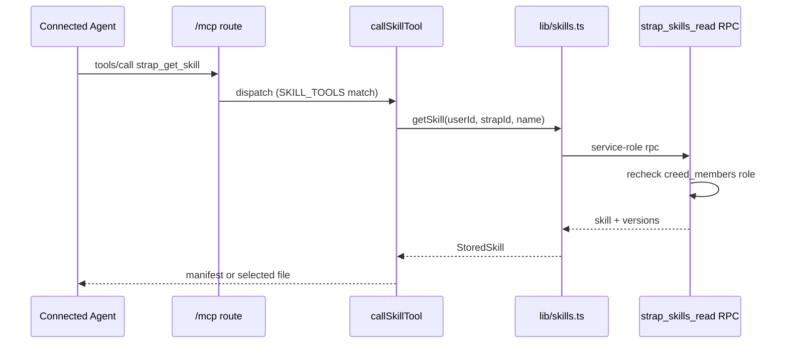

# Architecture overview

## System boundaries

Strap is a Next.js deployment backed by Supabase, OpenRouter, and GitHub. The code is organized mainly by trust boundary. Creed-named modules and routes remain where they are stable internal or compatibility contracts.

```text
Browser
  ├─ public pages and onboarding ───────────────┐
  └─ signed-in app (/file, /connections,        │
      /skills, /vault, /settings) → app/api/app/** │
                                                ▼
Agent or Strap CLI → browser/device OAuth → /mcp → Next.js route handlers
Headless agent → scoped Strap API key ──────────┘
Compatibility client → capability bearer → /api/creed/**
                                                │
                    ┌───────────────────────────┼──────────────────┐
                    ▼                           ▼                  ▼
                Supabase                   OpenRouter            GitHub
        Auth, Postgres, RLS, Vault,       model inference      profile sync
        and shared skill bundles
```

`proxy.ts` forwards a bounded request ID and `x-pathname`, and refreshes Supabase sessions only outside marketing routes. `app/layout.tsx` uses the pathname to avoid loading account state on public pages. `next.config.ts` sets security and cache headers; user-specific HTML is private/no-store.

## Per-profile resource model

Each Strap profile owns three intentionally independent resources. They share authorization context (which profile is active, and the caller's live membership/role) but do not share storage, write mechanics, or trust:

- **Context (profile sections):** the durable record of who the user is. Personal optimistic full-state vs. Company per-section server-authoritative writes (see Persistence split). Section edits and the proposal lifecycle never touch skills or Vault.
- **Secrets (Vault):** credentials stored in `public.creed_vault_items` with payloads at rest in Supabase Vault, revealed only through service-role RPCs. Vault is separate from skill bundles.
- **Shared workflow skills:** a per-profile library of agent-usable skill bundles (`public.strap_skills` / `public.strap_skill_versions`). Skills are intentionally separate from section editing and the proposal lifecycle, and separate from Vault secrets. They are read by connected agents and managed by profile owners/Company admins; they do not authorize secret access or script execution.

A connected agent operates within one resolved grant (Personal or Company) and its mode ceiling; that grant's `strapId` scopes all three resources to the same active profile.

## Signed-in application

`app/(strap-app)/layout.tsx` is the authenticated product boundary. It resolves the Supabase user, a persisted Personal Strap or live Company membership, unfinished Company onboarding, and one-time welcome state before mounting `AuthedProviders` and the product shell. There is no paid-plan or Stripe gate.

The route pages are thin. Product orchestration is concentrated in `components/strap/strap-provider.tsx`, `file-screen.tsx`, `connections-screen.tsx`, `skills-screen.tsx`, and settings components. Domain mapping and persistence live in canonical `lib/strap-*` implementations; old `lib/creed-*` modules are deprecated compatibility re-export shims.

### Active Strap resolution

A user can own a Personal Strap and belong to Company Straps. `lib/strap-context.ts` resolves one active record from the HTTP-only `creed_active` cookie, but revalidates live membership and falls back to Personal or the first accessible Company. The cookie is advisory, not authorization.

Use the operation-specific helpers (`resolveActiveCreed`, `resolveOwnedCompanyCreedId`, `resolveManagedCompanyCreedId`, and member resolvers) rather than trusting a caller-provided ID.

## Persistence split

Personal and Company share domain shapes but not write mechanics.

- **Personal:** the client keeps optimistic full state; human edits are debounced through `lib/strap-backend.ts`. Some structural proposal results become durable through the next full-state save.
- **Company:** `lib/company-sections.ts` and `app/api/app/sections/**` perform per-section, server-authoritative writes after membership, role, permission, and base-revision checks. Realtime plus bounded polling reconcile collaborators; versions support restore.
- **Skills:** both Personal and Company stores use the same server-authoritative RPC path (`strap_skills_read`, `strap_skill_publish`) against per-profile `strap_skills` rows. Publication is optimistic-concurrency over `baseRevision` and serialized per profile.

Reusing Personal full-state persistence for Company can overwrite concurrent work and bypass policy. Skills are not part of the Personal/Company section save path at all.

## API and protocol surfaces

| Surface | Authentication | Responsibility |
|---|---|---|
| `app/api/app/**` | Supabase session (`auth.getUser`) via `requireApiAuth` | Browser product operations, including headless keys, Vault, and `app/api/app/skills/**` |
| `app/api/app/skills/**` | Supabase session (`requireApiAuth`) | Session-authed browser skill library read/publish (list, get by name/revision, PUT publish) |
| `app/mcp/route.ts` | OAuth, new `strap_key_`, or accepted legacy `creed_key_` bearer | MCP tools/resources/prompts, permission-scoped mutations, and skill tools |
| `app/api/strap/**` | Hashed capability bearer | Canonical direct HTTP read, proposal, and write APIs |
| `app/api/creed/**` | Hashed capability bearer | Compatibility API shims for direct HTTP clients |
| OAuth/device routes | Session for approval; PKCE or device code for exchange | Registration, consent, grants, token rotation/revocation |

MCP discovery is Strap-first: tools are returned as `strap_*`/`read_strap` names and the canonical profile resource is `strap://profile`. Exact Creed tool names and `creed://profile` remain callable/readable compatibility aliases.

Skill tools are added to `tools/list` via `skillToolsFor` and dispatched through `callSkillTool` (`lib/skill-mcp.ts`). They expose four operations: `strap_list_skills`, `strap_get_skill`, `strap_export_skill`, and `strap_publish_skill`. `strap_publish_skill` is only listed when the credential mode is `direct` and the resolved role is `owner` or `admin`; all four read/export tools are listed for any connection that still has a `strapId`.

## Skill request flow



The diagram above traces a connected-agent skill read. Browser publishes follow the same RPC but enter through `app/api/app/skills/[name]/route.ts` PUT; both paths land in `strap_skill_publish`, which locks the profile row, rechecks `owner`/`admin` role, and rejects stale `baseRevision` with `PT409`.

## Authorization flow

Modern OAuth tokens and API keys resolve exactly one explicit Personal or Company grant. Browser consent writes a `direct` grant but still depends on live section permissions. Device OAuth and API-key creation expose `read-only`, `proposal-only`, and `direct` maximum modes. The mode is only a ceiling:

- read-only removes mutation capability and clamps visible sections to read;
- proposal-only removes direct edits and clamps to propose;
- direct still cannot exceed live membership, member agent ceiling, or section permission.

Skill publishing compounds on this: even a `direct` grant cannot publish unless the active profile role is `owner` or `admin`. `strap_publish_skill` is omitted from `tools/list` for read-only/proposal-only connections, and `callSkillTool` re-checks `canPublishSkills` before calling `publishSkill`.

If a modern explicit grant becomes inaccessible, MCP produces an empty write-less state. Only tokens positively marked as legacy and lacking grant rows may use historical Personal fallback.

## Data and external-service boundaries

- Session Supabase clients operate under RLS.
- Admin (service-role) clients bypass RLS, so application authorization must precede every sensitive call; skills RPCs recheck live membership and role inside the database before returning or writing.
- `public.strap_skills` and `public.strap_skill_versions` are RLS-enabled with all grants revoked from `public`/`anon`/`authenticated`; only `service_role` may select, insert, update, delete, and execute the read/publish functions. No client role receives direct table access.
- `/vault` metadata lives in `public.creed_vault_items`; payloads are at rest in Supabase Vault. Plaintext crosses Next.js/server memory only for create or rotation inputs and explicit reveal output through service-role-only RPCs.
- Skill bundles live in `public.strap_skills.files` (jsonb) plus retained history in `public.strap_skill_versions`. Bundles are validated in-app (`packages/strap/src/skills/bundle.ts`) for file count (≤128), total size (≤2 MiB per skill), portable paths, and base64 integrity before publishing; the RPC enforces the 100-skill-per-library cap and a 64 MiB total storage budget including history.
- OpenRouter receives bounded profile context and prompts; outputs are untrusted until parsed and validated.
- GitHub defaults new integrations to `strap.md`. Reading configured `strap.md` may fall back to `creed.md`, but push never creates a competing new file beside that fallback.

## Where to start for changes

- App access/switching: `app/(strap-app)/layout.tsx`, `components/strap/strap-switcher.tsx`, `lib/strap-context.ts`, `lib/strap-membership.ts`, and `app/api/app/straps/**`.
- Editing: `components/strap/file-screen.tsx`, `components/strap/strap-provider.tsx`, `lib/rich-text.ts`.
- Company mutation: `lib/company-sections.ts`, `lib/strap-permissions.ts`, section/proposal routes.
- Agent access: `app/mcp/route.ts`, `lib/oauth.ts`, `lib/oauth-device.ts`, `lib/headless-access.ts`.
- Vault: `lib/api-key-vault.ts`, `app/api/app/vault/**`, `components/strap/api-key-vault-screen.tsx`, relevant migrations.
- Profile files: `lib/profile-file.ts`, GitHub version-control modules/routes, `20260724120000_strap_profile_defaults.sql`.
- Skills: `lib/skills.ts`, `lib/skill-mcp.ts`, `lib/skill-tools.ts`, `lib/skills-http.ts`, `app/api/app/skills/**`, `components/strap/skills-screen.tsx`, `packages/strap/src/skills/*`, and the `20260913133911_shared_skills.sql` / `20260913153559_bound_skill_storage.sql` migrations.
- Public product/pricing: `lib/marketing/brand.ts`, `lib/marketing/pricing.ts`, marketing components.

Large orchestration files encode race handling and cross-feature assumptions. Read the complete Personal/Company, human/agent, and optimistic/server flow before simplifying them.
