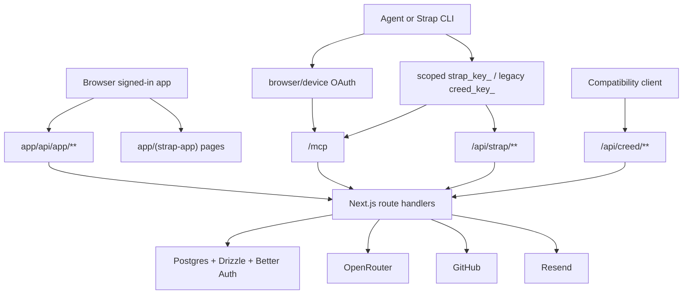
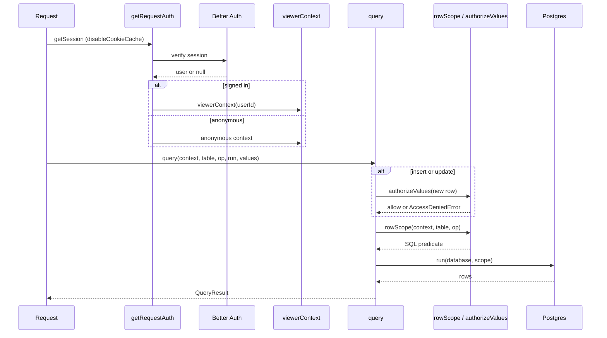
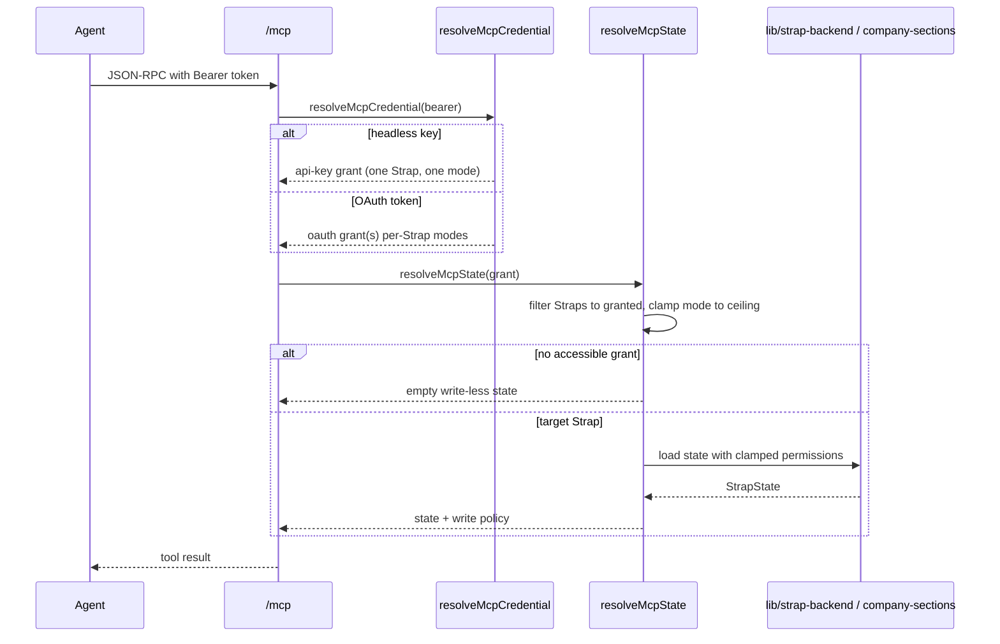

# Architecture overview

Strap is a Next.js 16 (App Router) application backed by a single Postgres database, OpenRouter for model inference, GitHub for profile-file sync, and Resend for email. The stack is organized by trust boundary rather than by feature. Code is TypeScript strict, defaults to server components, and keeps no personal information in source: brand strings, contact links, and social URLs come from `lib/marketing/brand.ts` env-driven constants.

The codebase pivoted from a developer-context product to a personal-context product. Canonical implementation lives under `app/(strap-app)/`, `components/strap/`, and `lib/strap-*`. Narrow `lib/creed-*` re-export shims, `/api/creed/**`, database identifiers, migration history, and `packages/creed-cli/` remain explicit compatibility surfaces left intact so existing imported user data keeps working.

## System boundaries

The diagram above shows the request surfaces and the backends they reach. Browser sessions hit `app/api/app/**` for product operations. Agents reach the MCP endpoint through browser/device OAuth or a scoped API key; headless and direct-HTTP clients use the capability-bearer APIs. All routes terminate in Next.js route handlers that talk to Postgres through the Drizzle-based data layer, OpenRouter for inference, GitHub for profile sync, and Resend for transactional email. Stripe is retired: `lib/legacy-subscriptions.ts` is a transport for offboarding existing subscriptions only, with no checkout or new billing.

## Database access model

The core architectural concept is a single connection plus application-level authorization contexts, replacing the retired Supabase/RLS/Vault model.

`lib/db/connection.ts` builds one `postgres` connection with `max: 1` and `prepare: false` (prepared statements disabled for PgBouncer/transaction pooler compatibility), TLS forced for non-local hosts. `lib/db/client.ts` lazily wraps it in a Drizzle instance so public routes and builds stay independent of the database.

A `DatabaseContext` (`lib/db/context.ts`) carries the Drizzle handle plus one of three actor kinds:

- `viewer` — a signed-in user (`{ userId }`), built by `viewerContext()`.
- `service` — an internal job or domain operation, built by `serviceContext(purpose)` in `lib/db/service.ts`. Server-only (`"server-only"`) and requires a non-empty named purpose.
- `anonymous` — no session; deny by default.

`lib/request-auth.ts` exports `getRequestAuth`, a `cache()`-wrapped render-singleton that resolves a Better Auth session into a `viewerContext` (with `userId`) or an `anonymous` context, disabling Better Auth's cookie cache so database lookups enforce revocation immediately. Browser API routes gate on this through `requireApiAuth()` (`lib/api-auth.ts`), which returns the `{ context, user }` pair or a 401 response.

Every viewer query goes through `lib/db/query.ts` `query()`, which applies `rowScope()` from `lib/authz/policies.ts` as a SQL predicate. `rowScope` is the application equivalent of the baseline's RLS policies: a `service` actor returns `true` (bypasses row scope), an `anonymous` actor returns `false`, and a `viewer` actor gets a per-table, per-operation predicate built from ownership, membership, role, and per-section visibility. Unknown tables and any non-select operation on an unrecognized table deny by default (`sql`false`). For insert/update, `authorizeValues` checks the NEW row before the write runs, preventing cross-profile upsert theft and moving an owned row to another profile. `query()` also normalizes driver errors to a generic message so query arguments (which can include ciphertext and PII) never leak.

A small set of retained, reviewed SQL functions are reachable only through `lib/db/procedures.ts` `callProcedure`, which requires a service context and re-validates membership, role, or opaque credentials internally. Service contexts bypass `rowScope` but the domain modules that use them re-check membership/role/credential before mutating.

## Authorization and permissions

`lib/authz/policies.ts` owns row-level scope; `lib/strap-permissions.ts` owns the role and agent-ceiling lattice. The two are deliberately separated: `policies.ts` decides which rows a viewer may read or write; `strap-permissions.ts` is pure, dependency-free logic (only a type-only import) shared byte-identically by server payload builders, company write-route guards, and the client UI.

Roles are `owner`, `admin`, or `member` (exactly one owner per Strap, enforced in the schema). The four section-permission levels reuse the `AgentPermission` vocabulary so the member ceiling and the agent ceiling share one lattice: `hidden` (invisible), `read-only` (visible, uneditable), `propose` (suggest, needs approval), `direct` (edit immediately). Owners and admins always have `direct` on every section and are never looked up in the override table; a member gets their per-section override or `direct` when no override row exists (the permissive default). Every ceiling operation is a `min` over the lattice, so combining the owner/admin ceiling with a member's own agent ceiling never grants more than either allows.

## Active Strap resolution

A user owns a Personal Strap and may belong to Company Straps. The app renders one Strap at a time, tracked by the HTTP-only `creed_active` cookie. `lib/strap-context.ts` `resolveActiveStrap` (cache-wrapped, one membership read per render) lists the user's Straps, picks the cookie's Strap if the user still belongs to it, else falls back to the Personal Strap, else the first accessible Company, else null (a brand-new user routed to onboarding). The cookie is advisory, never authorization: membership is revalidated on every read, so a removed member silently drops back to their personal Strap instead of seeing an error.

Use the operation-specific helpers and never trust a caller-supplied ID:

- `resolveActiveStrap` — the active Strap id, role, and switcher list.
- `resolveOwnedCompanyStrapId` — the active id only if it is a Company Strap the caller owns (owner-only company AI billing).
- `resolveManagedCompanyStrapId` — the active id only if it is a Company Strap the caller manages (owner or admin; GitHub sync).
- `resolveMemberCompanyStrap` / `resolveMemberCompanyStrapById` — any-role membership on the active or an explicitly named Company Strap.
- `setActiveStrap` — validates membership then sets the cookie (called by `POST /api/app/straps/activate`).
- `ensurePersonalStrapId` — provisions a missing Personal Strap.

## Signed-in application

`app/(strap-app)/layout.tsx` is the authenticated product boundary (`/file`, `/connections`, `/vault`, `/settings`). It owns the dynamic, user-specific gate: it resolves the session via `getRequestAuth`, redirects unauthenticated users to `/pricing`, and routes a personal-only user with no persisted Strap row to `/onboarding`. Company members skip the personal onboarding gate (their active company Strap decides what loads). If the user owns any Company Strap that has not finished setup, the layout resumes them into `/onboarding/company`. There is no paid-plan or Stripe gate.

The gate lives in this layout, not the root layout, so marketing pages prerender as a static shell. `proxy.ts` sets `x-request-id` (forwarded inbound or generated) and `x-pathname` on every non-asset route. The root layout (`app/layout.tsx`) stays static: it applies fonts, theme, and metadata only. Account-state loading happens in `AuthedProviders` (`components/strap/authed-providers.tsx`), which resolves the active Strap and loads its state before mounting `StrapProvider`.

## Persistence split

Personal and Company Straps share domain shapes but not write mechanics.

- **Personal:** the client keeps optimistic full state; human edits are debounced through `lib/strap-backend.ts` (`loadActiveStrapState` / the personal full-state load and PUT autosave). Some structural proposal results become durable through the next full-state save.
- **Company:** `lib/company-sections.ts` and `app/api/app/sections/**` perform per-section, server-authoritative writes on a service context after membership, role, permission, and base-revision checks, recording a version row (`creed_section_versions`) and an activity row on every change. A caller who lacks Direct edit on a section files a proposal instead. Realtime plus bounded polling reconcile collaborators; versions support restore. `hasPersistedCreed` returns false in company mode so the personal full-state PUT autosave never fires.

Routing shared Company edits through the Personal full-state autosave can overwrite concurrent work and bypass policy. The permission lattice, direct-vs-proposal routing, and draft vocabulary are identical between Personal and Company, so an agent connected to a Company Strap sees the same tools and behavior as on a personal one.

## API and protocol surfaces

| Surface | Authentication | Responsibility |
|---|---|---|
| `/api/app/**` | Better Auth session (`requireApiAuth`) | Browser product operations, including headless keys and Vault |
| `/mcp` | OAuth, new `strap_key_`, or accepted legacy `creed_key_` hashed bearer | MCP tools/resources/prompts and permission-scoped mutations |
| `/api/strap/**` | Hashed capability bearer | Canonical direct HTTP read, proposal, and write APIs |
| `/api/creed/**` | Hashed capability bearer | Compatibility API shims for direct HTTP clients |
| OAuth/device routes | Better Auth session for consent; PKCE or device code for exchange | Registration, consent, grants, token rotation/revocation |

`/api/app/**` routes must call `requireApiAuth()` on every handler; `/api/strap/**`, `/api/creed/**`, and `/mcp` must verify a hashed bearer. Tokens are opaque, stored as a SHA-256 hash for lookup plus an AES-256-GCM ciphertext (`lib/secret-crypto.ts`), so every token is per-client revocable with no new crypto or dependencies. OAuth is minimal OAuth 2.1 in `lib/oauth.ts` and `lib/oauth-device.ts`: opaque tokens only (no JWT), mandatory PKCE S256, single-use short-lived codes. Scoped API keys are created and resolved in `lib/headless-access.ts`.

### MCP credential and grant resolution

`app/mcp/route.ts` `resolveMcpCredential` turns a bearer into an `McpCredentialGrant`: a headless key (`strap_key_`/`creed_key_`) resolves to one explicit grant; an OAuth token resolves to its persisted per-Strap grants (`oauth_token_creeds`). Modern OAuth tokens and `strap_key_` API keys must resolve an explicit profile grant and mode before MCP dispatch.

`resolveMcpState` filters the user's Straps to only those the token was granted. If explicit grants become inaccessible, MCP produces an empty, write-less state (no section content, no write/direct tokens) rather than silently widening to the user's Personal Strap. Only an OAuth token positively identified as pre-grant legacy (`allowLegacyPersonalFallback`) may fall back to the Personal Strap.

The mode is only a ceiling, applied via `applyCredentialMode` as a `min` over the section permission lattice:

- read-only removes mutation capability and clamps visible sections to read;
- proposal-only removes direct edits and clamps to propose;
- direct still cannot exceed live membership, the member's agent ceiling, or the section permission.

MCP discovery is Strap-first: tools are returned as `strap_*` / `read_strap` names and the canonical profile resource is `strap://profile`. Exact Creed tool names and `creed://profile` remain callable/readable compatibility aliases through the same dispatcher.

## Data and external-service boundaries

- **Postgres** is the system of record. Drizzle (`db/schema/`) defines the tables; Better Auth (`lib/auth/create-auth.ts`, `lib/auth/server.ts`) uses the same Drizzle handle via `drizzleAdapter`, with email/password (verified, legacy-hash auto-upgrade), Google, and X social providers. There is no RLS or Supabase Vault; authorization is application-level.
- **Vault** (`/vault`) metadata lives in `public.creed_vault_items`; payloads are encrypted at rest with AES-256-GCM in `lib/vault-crypto.ts` using a per-row AAD binding `profileId` and `itemId`, keyed from `STRAP_VAULT_SECRET`. `lib/db/repositories/vault.ts` enforces its own membership/role scope (`scope()` predicate) on every read and write; reveal requires the required audit event to persist first, and re-checks authorization before returning plaintext. Plaintext crosses Next.js/server memory only for create/rotation inputs and explicit reveal output. Vault lists, logs, audits, and ordinary MCP responses contain metadata or references, never secret values.
- **OpenRouter** (`lib/ai/openrouter.ts`) receives bounded profile context and prompts; outputs are untrusted until parsed and validated. The deployment ships an included key and supports BYOK.
- **GitHub** (`lib/company-github.ts`, `lib/github.ts`) defaults new integrations to `strap.md` (`lib/profile-file.ts` `STRAP_FILE_NAME`). Reading the configured `strap.md` may fall back to `creed.md` (`LEGACY_CREED_FILE_NAME`), but push never creates a competing new file beside that fallback.
- **Resend** sends verification and reset email through `lib/email.ts`; Better Auth delivery is deferred to `after()` so the response is not blocked.

## Observability and constraints

Server-side logging uses `lib/observability.ts` (`log.info` / `warn` / `error`), emitting structured JSON; never `console.log` in committed code. Hard constraints to preserve when changing this surface:

- `requireApiAuth()` on every `/api/app/*` route; hashed-token verification on every `/api/strap/*`, `/api/creed/*`, and `/mcp` route.
- No personal info in source; route email/handles/names through `lib/branding.ts` env vars.
- Marketing routes never read user state; the gate lives in `app/(strap-app)/layout.tsx`, not the root layout.
- TypeScript strict, no `any` (use `unknown` + narrowing); default to server components; add `"use client"` only when genuinely needed.
- No em dashes in product copy; no new dependencies without justification.
- Secret plaintext stays inside its narrow reveal boundary.

## Where to start for changes

- App access and switching: `app/(strap-app)/layout.tsx`, `components/strap/authed-providers.tsx`, `lib/strap-context.ts`, `lib/strap-membership.ts`, `app/api/app/straps/**`.
- Database contexts and authorization: `lib/db/context.ts`, `lib/db/service.ts`, `lib/db/query.ts`, `lib/authz/policies.ts`, `lib/authz/viewer.ts`, `lib/request-auth.ts`, `lib/api-auth.ts`.
- Company permissions: `lib/strap-permissions.ts`, `lib/company-sections.ts`, section/proposal routes.
- Personal persistence: `lib/strap-backend.ts` (the personal load and full-state PUT autosave).
- Agent access: `app/mcp/route.ts`, `lib/oauth.ts`, `lib/oauth-device.ts`, `lib/headless-access.ts`.
- Vault: `lib/vault-crypto.ts`, `lib/api-key-vault.ts`, `lib/db/repositories/vault.ts`, `app/api/app/vault/**`.
- Profile files: `lib/profile-file.ts`, GitHub version-control modules/routes.
- Public product and pricing: `lib/marketing/brand.ts`, `lib/marketing/pricing.ts`, marketing components.
- Token encryption: `lib/secret-crypto.ts` (OAuth/API-key tokens), `lib/vault-crypto.ts` (Vault secrets).

Large orchestration files (`app/mcp/route.ts`, `lib/strap-backend.ts`, `lib/strap-data.ts`, `lib/company-sections.ts`) encode race handling and cross-feature assumptions. Read the complete Personal/Company, human/agent, and optimistic/server flow before simplifying them.
