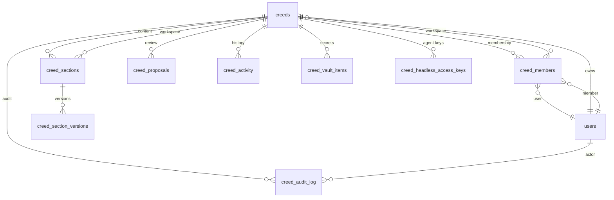
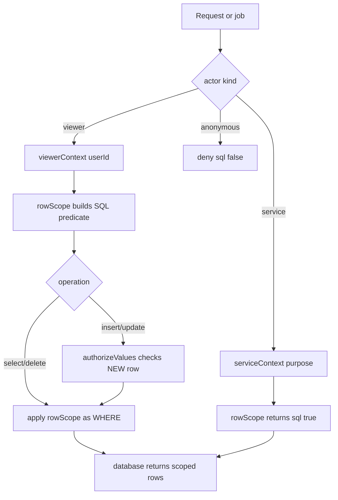
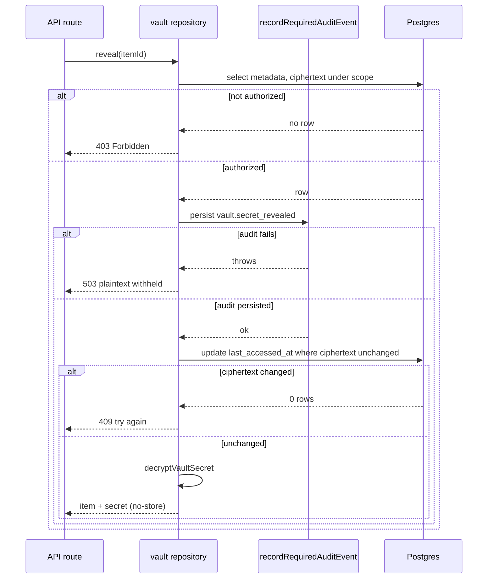

# Schema and security

Strap stores everything in Postgres 17+ (18 in hosted) and connects to it directly from the Next.js server. There is **no database REST endpoint and no Row-Level Security**; browsers reach authenticated app routes, and authorization is enforced in TypeScript before data is returned. The schema is declared with Drizzle, authentication uses Better Auth, and forward-only migrations are generated with `drizzle-kit`. The only SQL functions kept in the database are eight reviewed, atomic procedures that each bind actor ids and validate their own membership, role, or opaque credential.

## Schema evolution and naming

`db/schema/` declares 44 tables across `application.ts`, `auth.ts`, and `avatars.ts`. `db/migrations/0000_baseline.sql` is the single squashed baseline; its final block contains the eight retained atomic functions mirrored in `db/functions/baseline.sql`. Drizzle generates forward-only migrations via `npm run db:generate` (review the SQL before `npm run db:migrate`). Drizzle does **not** generate function migrations, so editing a SQL function requires both a new timestamped SQL migration **and** an update to `db/functions/baseline.sql`.

Database identifiers remain Creed-named for contractual continuity — do not rename them to match Strap branding:

- Core: `creeds` (a Personal or Company workspace), `creed_members`, `creed_sections`, `creed_proposals`, `creed_activity`, `creed_section_versions`.
- Credentials and agents: `creed_tokens`, `creed_headless_access_keys`, `creed_vault_items`, `creed_audit_log`, `creed_mcp_clients`, `creed_mcp_read_events`, plus OAuth tables (`oauth_clients`, `oauth_tokens`, `oauth_token_creeds`, `oauth_authorization_codes`, `oauth_device_authorizations`).
- History: `creed_ai_usage`, `creed_entitlements`, `creed_company_billing`, and other Stripe-era tables/columns.

`creeds` enforces one Personal and one Company workspace per owner through partial unique indexes (`creeds_one_personal_per_owner`, `creeds_one_company_per_owner`), and a `creeds_type_check` constrains `type` to `personal` or `company`. `creed_members` carries `role` (`owner`/`admin`/`member`), a partial unique index ensuring one owner per workspace, and a composite primary key `(creed_id, user_id)`. Tables widely reference `creeds.id` and `users.id` with `ON DELETE CASCADE`, so deleting a user or workspace reaps its dependents.

Because migrations are forward-only, Stripe-era tables and columns (`stripe_customer_id`, `creed_company_billing`, `creed_entitlements`, seat-purchase and credit-ledger rows) are retained as history. Some non-payment state still uses older tables, so do not infer live billing from schema names.

*Entity relationships around the `creeds` workspace hub and `users`; `creed_members` is the join that authorization predicates resolve against.*

## Application-level authorization (no RLS)

The database has no RLS policies. Authorization is reproduced in `lib/authz/policies.ts`, whose `rowScope(context, table, operation)` returns a SQL predicate that callers attach as a `WHERE`/condition. It is the application equivalent of the baseline's 45 RLS policies, and unknown tables or actions deny by default.

### Actor kinds and contexts

A `DatabaseContext` (`lib/db/context.ts`) pairs a Drizzle database handle with an actor of one of three kinds:

- `service` — bypasses `rowScope` (`sql\`true\``), used by internal jobs and domain operations after their explicit guard. A service context must carry a non-empty `purpose`; `requireService(context)` throws otherwise.
- `anonymous` — always denied (`sql\`false\``).
- `viewer` — a logged-in user identified by `userId`; `viewerContext` throws if `userId` is absent.

`serviceContext(purpose)` and `viewerContext(database, viewer)` are the only constructors. Browsers always receive a `viewerContext`; internal work uses `serviceContext` only after its own credential, membership, or role check.

### Per-table rules

`rowScope` derives three building blocks per table: `own` (`user_id = userId`), `profile` (the workspace id — `creeds.id` itself or a row's `creed_id`), and a correlated subquery for the caller's `role` in that workspace (`owner`/`admin`/`member`, or null). From these it composes:

- **Own-manage set** (`creed_ai_settings`, `creed_integrations`, `creed_tokens`, `creed_version_control`): all operations require `own`.
- **personalContent** (`creed_sections`, `creed_proposals`, `creed_activity`): writes require `personalOwner` (the caller is the owner of a Personal workspace); reads apply membership, the hidden-section visibility predicate, and deleted/billing visibility.
- **memberRead** (`creeds`, `creed_members`, `creed_connections`, `creed_credits`, `creed_credit_transactions`, `creed_mcp_clients`, `creed_mcp_read_events`, `creed_quality_reports`): reads require membership; writes fall through to the default `sql\`false\``.
- **Hidden-section visibility**: for sectioned content, rows are visible to managers, or to a member who is not marked `hidden` for that `section_id` in `creed_member_section_permissions`.
- **Owner-only**: `creed_company_ai_settings` and `creed_company_billing` reads require `role = 'owner'`; `creed_entitlements`, `creed_audit_log`, `creed_member_agent_permissions`, and `oauth_tokens` require `own`.
- **Specials**: `creed_invites` requires manager; `oauth_token_creeds` requires owning the referenced token; `creed_member_section_permissions` allows `own` or manager; `creed_ai_usage` inserts require `own` and reads allow `own` or manager; `creed_getting_started` allows `own` (except delete).
- Writes to any table not explicitly allowed return `sql\`false\``, denying the mutation.

### Value authorization on writes

`authorizeValues(context, table, operation, input)` checks the **NEW row** in addition to `rowScope`'s existing-row predicate. It prevents moving an owned row into someone else's workspace and cross-profile upsert theft: for own-manage tables the new `user_id` must equal the viewer's; for personalContent tables the new `user_id` and `creed_id` must resolve to a Personal workspace the caller owns. `lib/db/query.ts`'s `query()` helper runs `authorizeValues` for inserts/updates and threads `rowScope` into the runner, so the two checks stay paired.

*The authorization decision tree applied to every table access; service bypasses the predicate but still requires a named purpose.*

A core invariant: **never treat a client-supplied `creed_id` / `strapId` as authorization.** The caller's identity plus membership/role/ownership — resolved server-side, often from a row loaded by its own id — is the authority. Vault reveal, for example, authorizes from the item's database-loaded `creed_id`, not a caller-selected profile.

## Credential hashing and encryption

Two independent crypto modules handle credentials with different recovery semantics.

`lib/secret-crypto.ts` (key `STRAP_ENCRYPTION_SECRET`, with `CREED_ENCRYPTION_SECRET` fallback) provides:

- `hashSecret(value)` — SHA-256 hex digest, used for lookup indexes.
- `encryptSecret(value)` / `decryptSecret(value)` — AES-256-GCM with a random 12-byte IV; ciphertext is `iv.tag.body` joined by `.`.

OAuth access/refresh tokens and legacy agent tokens store **both** a SHA-256 hash (for lookup) and AES-256-GCM ciphertext (for recovery). Device/user codes and headless API keys are **hash-only** — they are never recoverable from storage.

### Headless access keys

`lib/headless-access-shared.ts` mints new keys with the `strap_key_` prefix (`creed_key_` legacy values remain recognized). `createHeadlessKey()` returns the full plaintext key, a display `prefix` (prefix + 8 chars), and a SHA-256 `hash`; only the digest (`key_hash`) and prefix are stored, and the plaintext is shown once in the creation response. `creed_headless_access_keys` constrains `mode` to `read-only` / `proposal-only` / `direct`, stores optional `expires_at` and `revoked_at`, and indexes `key_hash` uniquely. Each key binds exactly one creator, one Personal or Company workspace, and one mode that acts as a **ceiling**. `parseOptionalExpiry` rejects past dates and caps expiry at 366 days.

## In-application Vault (not Supabase Vault)

`/vault` stores workspace-scoped external secrets. There is no Supabase Vault; encryption happens in the application with `lib/vault-crypto.ts`, keyed by a **separate, independent** `STRAP_VAULT_SECRET` (at least 32 random characters, distinct from `STRAP_ENCRYPTION_SECRET`). The key is SHA-256-derived; encryption is AES-256-GCM with a random 12-byte IV and **Additional Authenticated Data bound to `strap:vault:v1:${profileId}:${itemId}`**, so a ciphertext cannot be relocated across profiles or items. The on-disk format is `v1.iv.tag.body`; `creed_vault_items` stores metadata plus `secret_ciphertext` — not a Vault secret id — with a unique `(creed_id, lower(name))` index.

Repository logic lives in `lib/db/repositories/vault.ts`; the high-level API in `lib/api-key-vault.ts` wraps it and emits audit events. Access is enforced by a `scope` SQL predicate: a Personal workspace requires the caller to be its owner; a Company workspace requires `owner`/`admin` (members get `403`). Mutation and reveal authorize using the item's database-loaded `creed_id`. Creation runs in a transaction with `SELECT ... FOR SHARE` on the creed+membership before inserting the ciphertext.

### Reveal is fail-closed

`vaultReveal` is the one place plaintext leaves the store. It orders the safety checks deliberately:

1. Select metadata + ciphertext under the `scope` predicate (denies with `403` if not found).
2. Call the `audit` callback — `recordRequiredAuditEvent` for `vault.secret_revealed` — **before** decrypting. If it throws, the repository returns `503` ("Vault reveal audit is unavailable") and withholds plaintext.
3. Conditionally update `last_accessed_at` only where the row's `secret_ciphertext` still equals the previously read value; if it changed (concurrent rotate/delete) it returns `409`.
4. Decrypt and return `{ item, secret }`.

*The reveal sequence orders durable audit before decryption, withholding plaintext (503) if the audit row cannot be persisted.*

### Plaintext boundary

The Vault is an at-rest boundary, not a claim that plaintext never reaches application code. Plaintext exists transiently in: the create/rotate browser form and request body; Node route and repository arguments; in-application decrypt; and the explicit reveal JSON response (sent with `no-store`) plus temporary browser state the UI clears after 30 seconds. Ordinary lists, logs, and agent context expose metadata or references only.

## Audit

`lib/audit-log.ts` writes to `creed_audit_log` under a service context. Actions are enumerated by the `AuditAction` union (token rotation, GitHub connect/disconnect, account deletion, vault lifecycle, Company provisioning/invite/membership events, etc.). Two write modes matter:

- `recordAuditEvent` — best-effort, fire-and-forget. It never throws; on failure it logs a warning (observable in production) but does not block the action. Call it *after* the action succeeds so failed actions don't pollute the log.
- `recordRequiredAuditEvent` — fail-closed. It throws if the database is unconfigured or the insert errors, so callers can fail closed before returning sensitive data. Vault reveal is the canonical caller.

## Retained SQL procedures

`lib/db/procedures.ts` exposes only seven reviewed functions (the eighth in the baseline, `strap_skill_document`, is an internal helper) and requires a service context (`requireService`). Each function validates its own membership, role, or opaque credential internally:

- `provision_company_creed(p_owner)` — advisory-locks per owner, reuses or creates the Company workspace, ensures the owner membership.
- `transfer_creed_ownership(p_creed_id, p_from, p_to)` — verifies the source is the company owner and the target is an active non-owner member, then atomically swaps roles and updates `creeds` and `creed_company_billing` ownership, asserting exactly one row changed at each step.
- `increment_mcp_read_for_creed(...)` — upserts a daily MCP read counter after checking the reader is an active member.
- `record_oauth_device_verification` / `consume_oauth_device_authorization` — implement the device-code polling state machine (pending/approved/denied/consumed, slow_down backoff, 10-attempt denial).
- `strap_skills_read` / `strap_skill_publish` — skills library read/publish with optimistic-revision checks, a 100-skill-per-library limit, a 64 MiB storage cap including history, and pruning of the oldest non-current revisions.

`callProcedure` maps known PostgreSQL error codes (`42501`, `P0002`, `PT409`, `22023`, `54000`) to surfaced messages; for any other code it returns a generic `"Database operation failed."` to avoid leaking driver details.

## Free product and historical billing

There is no active Stripe dependency, checkout/webhook runtime, paid-plan gate, or paid Company-seat flow. Open, Personal, and Company are `$0 forever`. Historical `stripe_*`, entitlement, billing, seat-purchase, and credit-ledger rows remain because migrations are forward-only and some non-payment state still uses older tables. Preserve them as history; do not infer live billing from schema names.

## Maintenance and retention

`POST /api/internal/maintenance` is the only retention entrypoint. It requires `Authorization: Bearer <STRAP_MAINTENANCE_SECRET>`; `lib/authz/maintenance.ts` checks the secret is at least 32 characters and compares SHA-256 digests with `timingSafeEqual` (so the secret itself is never directly compared). On success it prunes `creed_activity` older than 90 days and expired `oauth_device_authorizations` / `oauth_authorization_codes`, returning and logging only the counts. The daily GitHub Actions workflow needs the `STRAP_SITE_URL` repository variable and the `STRAP_MAINTENANCE_SECRET` secret after deployment.

## Migration discipline

When changing schema:

1. Add a timestamped migration file with `npm run db:generate` and review the generated SQL before `npm run db:migrate`.
2. Preserve applied history — never edit or reorder existing migrations.
3. Keep `lib/authz/policies.ts` rules aligned with any new tables or columns; unknown tables/actions deny by default.
4. Consider existing Personal/Company/history rows; forward-only migrations cannot rewrite them.
5. Run `npm run test:db`, which creates a random `strap_test_<id>` database per suite (the local role needs `CREATEDB`) and drops only that database afterward; existing application data is never truncated. `npm test` skips database suites without `DATABASE_URL`.
6. Confirm the connection before remote pushes.

Function edits are the exception: Drizzle does not generate function migrations, so a function change requires a SQL migration **and** an update to `db/functions/baseline.sql` (the reference file that mirrors the baseline's final block).
