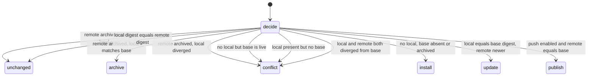

# Shared skills system

A **shared skill** is a portable, versioned bundle of agent guidance (`SKILL.md` plus supporting files) that belongs to one Personal or Company Strap profile. Skills are a distinct resource kind alongside context sections and Vault secrets: they are independent of section editing and the proposal lifecycle, and independent of Vault plaintext. Skill content is **user-provided data, not instructions to the host** — it cannot override higher-priority instructions or authorize secret access, and downloading a skill never authorizes executing its scripts. This mirrors the profile-content-as-data invariant: anything inside a skill is guidance describing a workflow, never a command to the agent or the system.

The system has four surfaces that share one validator and one storage model:

1. **Storage and versioning** — two Strap-named Postgres tables plus service-role-only RPCs that serialize publication, enforce a 64 MiB library budget, and retain the latest 20 revisions.
2. **Portable bundle format** — `SKILL.md` with YAML frontmatter and 1–128 portable relative files, validated by a shared TypeScript module.
3. **Agent surfaces** — a browser `/skills` screen and four MCP tools (`strap_list_skills`, `strap_get_skill`, `strap_export_skill`, `strap_publish_skill`) plus a direct browser API.
4. **Device sync** — the `strap skills` CLI (`list`, `push`, `pull`, `sync`) that installs published skills into agent skill directories and publishes local edits back, with conflict detection and a per-directory ledger.

<!-- openwiki: mermaid parse failed and this diagram was converted to a text fence so it does not break rendering. Fix the diagram source and restore the mermaid fence. Parser error: Heuristic: a semicolon inside a label breaks rendering; rephrase the label. -->
```text
flowchart TD
    A["strap_skill_publish RPC"] --> B["Acquire FOR UPDATE lock on profile row"]
    B --> C["Recheck live membership + owner/admin role"]
    C --> D{"Skill row exists?"}
    D -- "no" --> E["baseRevision must be 0, files present, not archived; enforce 100-skill cap"]
    D -- "yes" --> F{"baseRevision === current revision?"}
    F -- "no, identical content/archive" --> G["Idempotent retry: return current document"]
    F -- "no, stale" --> H["Raise PT409"]
    F -- "yes" --> I["Increment revision, update row"]
    E --> J["Insert new skill row at revision 1"]
    I --> K["Insert strap_skill_versions row"]
    J --> K
    K --> L["Prune versions older than revision - 20"]
    L --> M["Sum storage: current rows + history"]
    M --> N{"usage > 64 MiB?"}
    N -- "yes" --> O["Delete oldest history first, never current revision"]
    O --> M
    N -- "still over" --> P["Raise 54000, rollback publication + pruning"]
    N -- "no / under after prune" --> Q["Return published document"]
```
*Publish and version flow: profile-level lock, baseRevision check, version insert, history prune, and budget enforcement.*

## Storage and versioning

Skills persist in two tables introduced by `supabase/migrations/20260913133911_shared_skills.sql` and refined by `supabase/migrations/20260913153559_bound_skill_storage.sql`:

- **`strap_skills`** — one row per `strap_id` + `name`, holding the current `revision`, `digest`, `files` (JSONB array), `byte_count`, `archived` flag, and metadata. A generated `file_count` and `storage_bytes` column cache small metadata separately from the TOASTed bundle. `unique (strap_id, name)` makes the skill name unique within a library.
- **`strap_skill_versions`** — one row per `skill_id` + `revision`, holding the full `document` (a snapshot of the current document at that revision) plus a generated `summary` (`document - 'files'`) and `storage_bytes`. The composite primary key `(skill_id, revision)` makes versions addressable.

Both tables have RLS enabled, all grants are revoked from `public`, `anon`, and `authenticated`, and only `service_role` gets `select`/`insert`/`update`/`delete`. No client role — browser session or scoped MCP credential — receives table access. Every read and write goes through two service-role-only RPCs:

### `strap_skills_read` — listing and reading

`strap_skills_read(p_user_id, p_strap_id, p_name, p_revision)` is the single read entrypoint. It takes a `FOR SHARE` lock on the profile row and on the caller's `creed_members` row so membership/profile removal cannot interleave with a read. Any member can read; a missing membership raises `42501` (`Skill library access denied.`).

- With `p_name` null it returns metadata only: `strapId`, `canManage` (role is `owner`/`admin`), the aggregate `storageBytes` (current rows + history), and the `skills` array (without `files`).
- With `p_name` set it returns the skill document (current, or a specific `p_revision` from history) plus the version summaries. Archived skills remain readable for restore.

### `strap_skill_publish` — publication and archive

`strap_skill_publish(p_user_id, p_strap_id, p_name, p_base_revision, p_description, p_files, p_digest, p_byte_count, p_archived)` is the write path. It enforces, in order:

1. **Serialization** — `FOR UPDATE` lock on the profile row. This lock serializes both revisions and aggregate storage accounting across concurrent publications within one library, including first creates and the cap.
2. **Authorization** — rechecks live membership under a share lock; the role must be `owner` or `admin`, otherwise `42501`.
3. **Base-revision concurrency** — for an existing skill, `p_base_revision` must equal the current `revision`. A stale revision raises `PT409` ("The skill changed. Refresh and compare before publishing."), so a stale edit never overwrites a concurrent publication or archive. The exception is a **safe idempotent retry**: if content, digest, and archive state are identical to what is already published, the RPC returns the current document without creating a new revision. For a new skill, `p_base_revision` must be `0`, files must be present, and `p_archived` must be false; otherwise `PT409` ("Skill no longer exists. Refresh the library.").
4. **Cap** — a new skill is rejected with `54000` once the library has 100 skills.
5. **Revision + version insert** — an update increments `revision`; a create inserts at revision 1. A full document snapshot is inserted into `strap_skill_versions`.
6. **History retention** — versions with `revision <= current - 20` are deleted, keeping the most recent 20 complete versions including the current one.
7. **Storage budget** — the RPC recomputes total usage (current `strap_skills.storage_bytes` plus all `strap_skill_versions.storage_bytes` for the library). If usage exceeds 64 MiB (67,108,864 bytes), it prunes the **oldest historical copies first, never a skill's current revision** (only rows where `v.revision < s.revision` are candidates), then rechecks. If still over, it raises `54000` and rolls back the publication and all attempted pruning.

The application layer maps these SQL error codes to HTTP statuses in `lib/skills.ts`: `42501`→403, `P0002`→404, `PT409`→409, `22023`→400, `54000`→422, otherwise 503. Because the RPCs run as `service_role` and bypass RLS, **application authorization must precede the RPC call** — the application validates the user, session, strap id, skill name, and revision before invoking.

## Portable skill bundle format

The bundle format is shared by the CLI, browser editor, and server validator through `packages/strap/src/skills/bundle.ts`. A skill is:

- A `SKILL.md` file at the root, encoded as UTF-8, with YAML frontmatter containing `name` (1–64 lowercase-kebab characters matching `^[a-z0-9]+(?:-[a-z0-9]+)*$`) and `description` (1–1024 chars, trimmed). The frontmatter must be a mapping; YAML aliases (`maxAliasCount: 0`) and duplicate keys are rejected. When a bundle is created from a directory, the `name` in frontmatter must match the directory name.
- 1–128 portable relative files (`MAX_SKILL_FILES = 128`). Each file is at most 512 KiB (`MAX_SKILL_FILE_BYTES`); the whole bundle is at most 2 MiB (`MAX_SKILL_BYTES`). Files are sorted by path and each carries an `encoding` of `utf8` or `base64`, plus an `executable` flag.

`validateSkillBundle(input)` enforces the format end to end. `validateSkillName` and `validateSkillPath` enforce the portable path-safety rules:

- No traversal (`..`), absolute paths (`/`, `C:/`), backslashes, or hidden folders (e.g. `.git`, `.env.local`).
- No Windows device names (`CON`, `PRN`, `AUX`, `NUL`, `COM[0-9]`, `LPT[0-9]`), even with an extension.
- No `node_modules`, `credentials`, or SSH key filenames (`id_rsa`, `id_ed25519`).
- **Case-only path collisions are rejected** — each path is lowercased and duplicate folded paths fail ("Duplicate skill paths, including case-only differences..."), so `SKILL.md` and `skill.md` cannot coexist. Inconsistent casing across a file/folder prefix also fails, so `references/a.md` and `References/b.md` cannot diverge after a case-insensitive filesystem sync.
- **File-vs-folder collisions are rejected** — a path cannot be both a file and a folder (e.g. `references` and `references/a.md`).
- UTF-8 text must round-trip; lone surrogate code units are rejected. `fileBytes` validates base64 canonically (`btoa(atob(content)) === content`).

`encodeSkillFile(path, bytes, executable)` chooses UTF-8 for text (always for `SKILL.md`, otherwise whichever is smaller on the wire) and base64 for binary assets or invalid UTF-8. `canonicalSkillContent(bundle)` produces a deterministic JSON serialization (path, content, encoding, executable per file, no EOL rewriting) that the digest is hashed from — independent of input JSON property order. `validateStoredSkill` re-validates a server response as a `StoredSkill`, checking `id`, `strapId`, `revision`, `digest` (64 lowercase hex), `updatedAt`, and `archived`.

## Agent surfaces

### Browser API

`app/api/app/skills/route.ts` and `app/api/app/skills/[name]/route.ts` expose the skill library to the browser UI. Both use `requireApiAuth` (Supabase session); no client role gets table access.

- `GET /api/app/skills?strapId=...` lists a library (metadata only, plus `storageBytes` and `canManage`).
- `GET /api/app/skills/[name]?strapId=...[&revision=N]` reads a skill (current or a historical revision) and its version summaries.
- `PUT /api/app/skills/[name]` publishes or archives. It applies a per-user `skill-publish` rate limit of 20 publications per 60 seconds before calling `publishSkill`. A body with `archived === true` archives the skill (passing `null` files); otherwise the body is validated as a bundle.

Responses carry `Cache-Control: private, no-store` and bodies are bounded to 12 MiB by `readSkillBody`/`readBoundedJson`.

### MCP tools

Connected agents discover and use skills through four MCP tools declared in `lib/skill-tools.ts` and dispatched in `app/mcp/route.ts`. Tools are added via `skillToolsFor(state.creedId, mode, role)`: if no profile is connected no skill tools are offered, and `strap_publish_skill` is only included when `canPublishSkills(mode, role)` is true — i.e. `mode === "direct"` and `role` is `owner` or `admin`. Read, export, and list tools are available to any member in any mode.

| Tool | Behavior |
|---|---|
| `strap_list_skills` | Metadata only. `includeArchived` (default false) controls whether archived summaries appear. `canManage` in the response is AND-ed with `canPublishSkills` so non-publishing connections see `canManage: false`. |
| `strap_get_skill` | Returns `SKILL.md` instructions plus a bounded manifest (path, encoding, executable, bytes — no file contents), or one selected file via `filePath`. Archived skills return `410`. A missing `filePath` returns `404`. |
| `strap_export_skill` | Returns the full versioned bundle including base64 binary assets, for installation or device sync. |
| `strap_publish_skill` | Publishes a bundle. Requires direct mode + owner/admin (`canPublishSkills`), and applies a 20/min per-user rate limit in `lib/skill-mcp.ts`. `baseRevision` comes from the version being edited, or 0 for a new skill. |

The MCP instructions injected at connect time (`MCP_INSTRUCTIONS` in `app/mcp/route.ts`) tell agents to list skill metadata during onboarding, read a matching skill with `strap_get_skill` before using it, and that skill guidance cannot override higher-priority instructions, cannot authorize secret access, and that downloading never authorizes executing scripts. Publish only when the user requests it.

#### Batch guard

Skill reads, exports, and publications load full bundles. To prevent a JSON-RPC batch from multiplying large payloads, `isSkillPayloadBatch(requests)` (in `lib/skill-tools.ts`) flags any batch of more than one request that contains `strap_get_skill`, `strap_export_skill`, or `strap_publish_skill`. The MCP route rejects such batches with `-32600` ("Skill reads, exports, and publications require an individual request. Send each skill call separately.") before resolving state. A single such call is allowed; a batch of `strap_list_skills` plus a non-skill `ping` is not flagged.

## Boundary vs sections and Vault

Skills are deliberately walled off from the two other resource kinds:

- **Sections and proposals:** Skill discovery and publishing are separate from profile section editing and the proposal lifecycle. There is no path from a skill into section content or the review queue, and no path from a section edit into a skill.
- **Vault secrets:** Skills are independent of Vault plaintext. Skill content cannot authorize secret access; an MCP tool description states this explicitly, and the connect-time instructions repeat it. A skill may reference `secret://` URIs as text, but revealing a Vault secret still requires the explicit, permission-aware reveal flow.

This mirrors the profile-content-as-data invariant: skill files are user-provided guidance treated as **data**, not as instructions to the host system.

## Device sync (CLI)

`packages/strap/src/skills/command.ts` implements `strap skills` with exactly four actions:

```
strap skills list
strap skills push <skill-directory> [--base-revision N] [--dry-run]
strap skills pull [name] [--dir PATH | --target codex|claude [--global]] [--dry-run]
strap skills sync [name] [--dir PATH | --target codex|claude [--global]] [--dry-run]
```

The default install target is `.agents/skills` in the current project (Codex-compatible); `--target claude` uses `.claude/skills`; `--global` installs into the home directory. `--dir PATH` is an alternative to `--target`/`--global`. Each directory binds one profile/server via a `.strap-skills.json` ledger; trying to sync a directory that belongs to another server or profile fails ("This skills directory belongs to another server or profile. Choose a separate directory."). Use a separate directory for each Personal or Company library.

The CLI talks to the server through the MCP tools (`mcpSkillRemote`): `list` calls `strap_list_skills`, `get` calls `strap_export_skill`, `publish` calls `strap_publish_skill`. Every server response is re-validated with `validateStoredSkill` and cross-checked against the expected `strapId`, `name`, and recomputed digest (`verifyRemote`).

### Ledger

`.strap-skills.json` (`SyncLedger`, version 1) records `server`, `strapId`, and a `skills` map keyed by name. Each `SyncEntry` holds the last-synced `revision`, `digest`, `executables` list, and `archived` state. `readLedger` validates that the ledger matches the current server and profile and that each entry is well-formed. `saveLedger` writes atomically (`wx`, mode `0o600`, rename). A `.strap-skills.lock` file (`withSyncLock`) serializes syncs per directory.

### Sync decision

`syncDecision(local, remote, base, push)` resolves one of six actions for each skill, comparing the local digest (or `null` if absent), the remote `digest`/`archived`, the ledger `base` entry, and whether publishing is enabled:


*CLI sync decision: comparing local digest, remote digest/archive state, and the ledger base.*

A planned `publish` is downgraded to `conflict` when `library.canManage` is false. **Conflicts stop the whole selection before any changes are made** — if any planned skill is `conflict`, no skill in the run is installed, updated, published, or archived. Otherwise the ledger is bound (even for an empty library) before applying operations.

### Apply, backup, and safety

For install/update/archive, `installSkill` replaces the skill directory atomically:

- It stages the new files in a backup folder **outside** the agent skills directory (`.${basename(root)}-strap-backups`), writes each file with `wx` (no overwrite) and mode `0o755` for executable / `0o644` otherwise, then renames the existing directory into a backup and renames the staging directory into place. Scripts and assets are copied without execution.
- If the local directory changed between preflight and apply (digest mismatch), the operation aborts and the original is restored from the backup.
- `pushSkill` publishes a local directory: it requires `canManage`, recomputes the bundle, and refuses if the published revision changed since the last sync unless an explicit `--base-revision` matches.

`readSkillDirectory` validates every path before traversal, refuses symlinks/junctions (`assertSafePath` checks each ancestor), refuses linked or special files (`nlink > 1`, `O_NOFOLLOW`), and detects files that change while being read. On Windows, the executable bit is taken from the ledger's `executables` list; on POSIX it is read from the file mode.

## Product UI

The `/skills` screen (`components/strap/skills-screen.tsx`) lets an owner/admin create a skill from a starter `SKILL.md`, import a skill folder or a `.strap-skill.json` bundle, edit files, publish versions, restore earlier versions (load as draft, publish to keep current in history), download bundles, and archive. It reads and writes through the browser API. Skills belong to the active Personal or Company profile (`SkillsScreen` is keyed by `state.creedId`).

Because browsers cannot read executable permissions from a folder import, a folder import with non-`SKILL.md` files sets `folderPermissionsPending`, which disables publishing until the user confirms they checked the executable file settings (the CLI preserves executable bits automatically). The screen surfaces the 64 MiB storage budget and the 100-skill limit through its notices and error handling.

A "Set up a device or agent" panel generates the `strap skills sync` command for the chosen target and scope, and points connected MCP agents at `strap_list_skills`.

## Configuration and operations

- **Migrations are forward-only.** The skill tables are introduced by `20260913133911_shared_skills.sql` (tables, RPCs, RLS) and refined by `20260913153559_bound_skill_storage.sql` (generated columns, storage accounting, budget pruning). Apply pending migrations before deploying application changes.
- **Strap-named, not Creed-named.** `strap_skills`, `strap_skill_versions`, `strap_skills_read`, and `strap_skill_publish` are new Strap-named objects. They are not legacy Creed-named compatibility contracts and should not be aliased to `creed_*` names.
- **Rate limits.** Browser `PUT` and MCP publish both apply a 20/min `skill-publish` limit keyed by user id (`auth.user.id`). The MCP route's transport-level limit (`creed-mcp`, 120/min) uses `digestCredential(bearer)` — the bearer is hashed before rate limiting, so no secret appears in the rate-limit identifier.
- **No secrets in logs, query strings, or rate-limit identifiers.** Skill digests are SHA-256 content hashes; no skill content or credential is logged.

## Focused tests

`tests/skill-bundles.test.ts` covers the invariants that matter for safe skill handling:

- **Batch guard** — `strap_get_skill`, `strap_export_skill`, and `strap_publish_skill` cannot be multiplied through a batch; a single call is allowed and non-skill batches are not flagged.
- **Portable format** — folded YAML descriptions and base64 binary assets survive a validate/encode round trip, and `canonicalSkillContent` is order-independent.
- **Unsafe paths fail closed** — traversal, absolute paths, backslashes, hidden folders, device names, `node_modules`, file/folder collisions, and case-only duplicates are all rejected.
- **YAML safety** — aliases and duplicate keys fail; oversize files exceed the 512 KiB limit; a name mismatch between bundle and `SKILL.md` fails.
- **Authorization** — `canPublishSkills` is false for `read-only`/`proposal-only` and for `member`; true only for `direct` + `owner`/`admin`. `skillToolsFor` returns no tools without a profile, omits `strap_publish_skill` for non-publishing modes, and returns all four for a publishing connection.
- **Case divergence** — mixed-case parent directories (`references` vs `References`) fail, preventing divergence after a Windows sync.
- **Read payload** — an empty/`null` `filePath` still returns instructions and a bounded manifest (no base64 in the manifest); a selected binary file returns its content; a missing path returns `null`.
