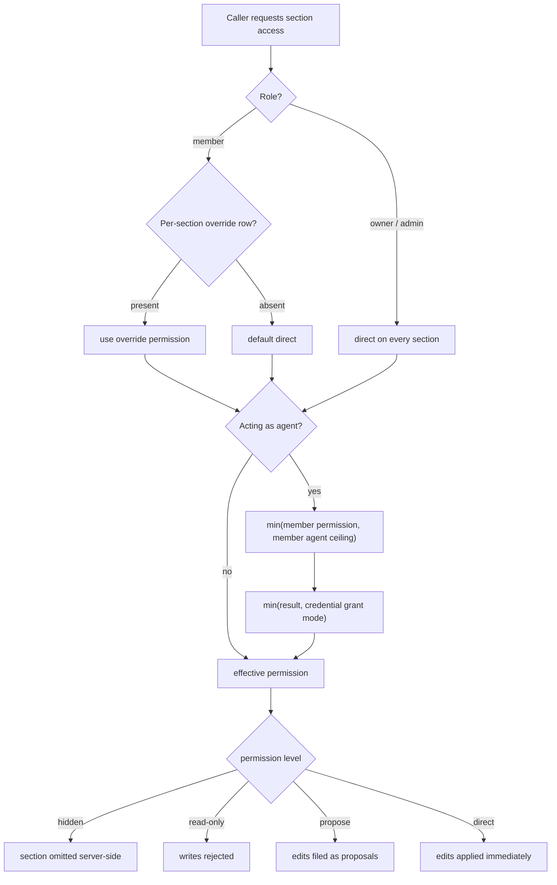

# Strap domain model and workflows

## Product model

A **Strap** is a compact canonical context profile read by AI agents before work.
It contains ordered sections, governed proposals, and activity/history. Agents
should tighten, merge, update, and prune durable facts rather than append every
observation; the read payload and the agent contract are built for that
discipline.

Two product modes share the model:

- **Personal Strap:** one owner and single-writer-optimized persistence. The
  whole file is one owner's state, saved through a full-state PUT.
- **Company Strap:** owner/admin/member roles, shared sections, per-member
  controls, concurrency checks, and collaboration. Writes go through
  per-section server-authoritative routes, not the personal full-state PUT.

Open, Personal, and Company are currently free. Active runtime access is not
gated by Stripe or a paid entitlement.

The primary shared types and transformations live in `lib/strap-data.ts`
(`AgentPermission`, `StrapSection`, `ProposalDraft`, `sectionToMarkdown`,
`buildVisibleStrapMarkdown`, the agent-read payload builder, and the legacy
normalizers). Personal mapping/persistence is in `lib/strap-backend.ts`; Company
writes/versioning in `lib/company-sections.ts`; membership and active-Strap
resolution in `lib/strap-membership.ts` and `lib/strap-context.ts`. The old
`lib/creed-*` paths are deprecated compatibility re-export shims (e.g.
`lib/creed-permissions.ts` and `lib/creed-markdown.ts` re-export
`lib/strap-permissions.ts` and `lib/strap-markdown.ts`); **Creed-named database
identifiers remain compatibility contracts**, so tables and columns keep their
`creed_*` names even though the TypeScript surface is `Strap*`.

## Sections and permissions

A section has a stable ID, display name, position, accent, normalized Tiptap
HTML, revision, attribution, archive state, and agent permission
(`StrapSection` in `lib/strap-data.ts`). `lib/rich-text.ts` owns HTML
normalization, whitespace-equivalence (`richTextContentEquivalent`), and
Markdown→HTML conversion (`markdownToRichHtml`); nothing else should re-derive
those conversions.

The permission lattice is the shared vocabulary for both the member ceiling and
the agent ceiling:

```text
hidden < read-only < propose < direct
```

`lib/strap-permissions.ts` is the pure TypeScript policy source shared
byte-identically by three call sites: the server payload builders (strip
`hidden` sections before they leave), the Company write-route guards, and the
client UI. **It must stay equivalent to the app-level authorization rules in
`lib/authz/policies.ts`**, not to RLS: `lib/authz/policies.ts` expresses the
row-scope and value-check predicates (`rowScope`, `authorizeValues`) that are
the application equivalents of the baseline's RLS policies, and
`lib/strap-permissions.ts` defines the role/agent-ceiling rules those predicates
and the write routes rely on. `lib/creed-permissions.ts` is only a deprecated
re-export shim.



*Permission resolution for a member and their agent (from `resolveSectionPermission`, `effectiveAgentPermission`, and `minPermission`).*

The rules:

- Company owner/admin human access resolves to `direct` on every section
  (`resolveSectionPermission`).
- A member uses their per-section override, defaulting to `direct` when no
  override row exists (`creed_member_section_permissions`).
- Agent access is the **minimum** of the member's section permission, the
  member's per-section agent ceiling (`creed_member_agent_permissions`, no row =
  `propose`), and the credential's grant mode. Every ceiling operation is a
  `min` over the lattice, so combining ceilings can only narrow — an agent can
  never exceed its member.
- A credential mode can only narrow access; it cannot grant visibility or
  mutation absent from live policy (`companyMcpWrite` re-derives live membership
  and section permissions and applies a `permissionCeiling`).
- Owner/admin manage members and section lifecycle (archive/delete/reorder,
  `canManageMembers`, `canManageSectionsLifecycle`); owner-only operations
  include Company BYOK, ownership transfer, and deletion (`lib/company-admin.ts`).

Personal onboarding centers on Identity, Goals, Work, Preferences, and
Routines. Company onboarding seeds Company, Ethos, Operating Rules, People,
Projects, Clients, Tools, and Agent Rules. Archived or hidden sections are not
exposed to agents (the read payload filters them; `buildVisibleStrapMarkdown`
excludes archived sections); imported GitHub sections default to `propose`
permission (`parseStrapMarkdown` sets `agentPermission: "propose"`).

## Proposals, direct edits, and history

A change to a Strap is one draft from a shared vocabulary. For Company, the
draft kinds are `rich-text` (content and/or name/accent), `new-section`,
`delete-section`, and `reorder-section` (`CompanyDraft` in
`lib/company-sections.ts`). A proposal carries attribution,
reason/impact/confidence metadata, status (`pending`/`accepted`/`rejected`/
`stale`), and a `base_revision` pinning the point the change was drafted at.
Direct edits and accepted proposals both flow through one `applyDraft` so they
mutate the section rows identically.

For Company review (`reviewCompanyProposal`):

- owner/admin can review any visible proposal;
- members can review only where they hold `direct` on the section
  (`canApproveProposal`);
- authors may **withdraw** their own proposal, but authorship does not confer
  approval;
- new-section proposals have no existing section to hold a permission on, so
  they require owner/admin review;
- only `pending` proposals are reviewable — a double-accept is rejected as a
  conflict rather than re-applied;
- on accept, a `rich-text` draft whose `base_revision` no longer matches the
  current section revision is marked `stale` (kept for the audit trail) rather
  than applied, so a stale proposal can never clobber newer content.

Direct Company edits (`updateCompanySection`) also require `baseRevision` and
return a 409 conflict when it mismatches. No-op guards (whitespace-equivalent
content, unchanged name/accent) short-circuit before any version, activity, or
proposal row is written, so a stray-space save never reads as an edit.
Successful mutations record a `creed_section_versions` row (lazy-pruned to the
newest 200 per section) and a `creed_activity` row; **restore creates a new
revision via `applyDraft` with cause `restore`** rather than erasing history, so
a restore can itself be undone. Section version listing and restore are
owner/admin only.

Personal proposal handling is deliberately more client-oriented and must not
be interchanged with the Company paths: `reviewPersonalProposal` makes the
**resolution** durable at click time (reject deletes the row; a content accept
applies server-side then deletes the row; a structural accept deletes the row
only and lets the client's full-state PUT land the structure). The client
already ran the staleness guard against the same revisions, and a Personal Strap
has a single writer, so the server accept does not re-check `baseRevision`. The
client applies the draft to local state instantly; its autosave later persists
sections/activity as usual, and some structural outcomes rely on that next
full-state persistence cycle.

## Onboarding

### Personal

1. The user answers a short questionnaire.
2. `lib/onboarding/compile.ts` deterministically compiles the answers into a
   five-section skeleton (Identity, Goals, Work, Preferences, Routines). Work
   and Routines ship as light stubs; Identity/Goals/Preferences carry the user's
   words or a stub fallback. Every starter section is agent-writable at
   `propose`.
3. The product provides a composition prompt for an external assistant.
4. Returned Markdown is previewed, parsed, and claimed as the initial Personal
   Strap.
5. Completion enters the hosted app; there is no paid-plan gate.

### Company

1. `POST /api/app/company` idempotently creates or resumes the owner's one
   Company shell and owner membership via the `provision_company_creed`
   procedure (`lib/company-provision.ts`), then makes it active.
2. The owner answers organization questions.
3. `lib/onboarding/compile-company.ts` prepares eight sections (deterministic,
   no AI, no IO) and the composition prompt is provided.
4. The seed action persists those sections (ids namespaced to the Strap to
   avoid colliding with the owner's Personal section ids) and sets
   `onboarding_stage`; the compose action maps pasted Markdown onto the seeded
   sections by heading name.
5. Completion (`action: complete`) clears `onboarding_stage` and activates the
   Company Strap. Invites follow and are not paid-seat purchases.

The app layout scans all owned Company records for unfinished setup
(`onboarding_stage != null` drives the switcher's "Set up" affordance), so a
stale Personal active cookie cannot hide a resume — `resolveActiveStrap` always
re-validates the cookie against live membership and prefers an owned, unfinished
company over a stale personal selection.

## Collaboration and concurrency

Company editing combines server-authoritative writes with realtime and bounded
polling. The provider (`components/strap/strap-provider.tsx`) is the client
orchestrator:

- Personal saves a full-state PUT, debounced; Company saves per-section through
  the section APIs, debounced per section id with one save in flight per
  section (serialized so a section's own overlapping autosaves cannot trip the
  revision guard).
- Local pending creates are tracked in `pendingCreatedSectionIdsRef`; the merge
  preserves these local-only sections so a racing sync cannot delete them
  mid-typing.
- A `mutationTick` stamps every local mutation; a sync can only replace the
  sections array when `mutationTick === lastPersistedTickRef`, i.e. when there
  is no unsaved local change. Otherwise the merge keeps local sections.
- `lastCompanyMutationAtRef` plus `COMPANY_MUTATION_QUIET_MS` (8s) keep a full
  local-sections freeze for a short window after any local company mutation, so
  in-flight structural POSTs (accept, archive, reorder, rename) cannot be
  reverted by an older fetch.
- Polling is bounded: `SYNC_MIN_GAP_MS` (1.5s) collapses bursts, and
  `SYNC_ACTIVE_WINDOW_MS` (120s) keeps the fast cadence only while activity is
  recent. A `BroadcastChannel` announces cross-tab saves so a second tab resyncs
  (trailing-debounced) instead of waiting for its poll.
- Locally resolved proposals (accepted/rejected/gone-stale) whose server
  confirmation may not have landed are held in `resolvedProposalIdsRef` so the
  merge does not resurrect them.

The net effect is that older fetches cannot overwrite optimistic changes, and a
browser refresh mid-review can never resurrect an already-reviewed proposal.

## GitHub serialization

GitHub version control defaults new integrations to `strap.md`
(`STRAP_FILE_NAME` in `lib/profile-file.ts`). Serialization is split across two
pure modules: `lib/strap-markdown.ts` owns the pull parser (`parseStrapMarkdown`)
and `lib/strap-data.ts` owns the push serializer
(`sectionToMarkdown`/`buildVisibleStrapMarkdown`); `lib/creed-markdown.ts` is
only a deprecated re-export shim.

- `##` headings are section boundaries. `parseStrapMarkdown` matches `^##?\s+`
  headings and maps each body to a `StrapSection`; known section names (and
  legacy aliases like `stack`, `principles`, `workflows`) normalize to canonical
  ids and accents.
- On export, nested headings shift **down** one level so they nest under the
  section's own `## Name` (`<h2>`→`###`, `<h3>`→`####`, `<h4>`→`#####`). On import,
  `parseStrapMarkdown` reverses the shift before delegating to
  `markdownToRichHtml`, so section-local headings come back at their original
  level. The round trip is designed for supported editor markup, not arbitrary
  byte preservation.
- Accent is preserved in an HTML comment under the heading
  (`<!-- creed:accent=... -->`), injected by `buildVisibleStrapMarkdown` and read
  back by the pull parser. That comment is a retained format identifier (the
  `creed:` prefix is intentional back-compat), and it is stripped before content
  reaches the editor or AI prompt bodies.
- Pulled sections are agent-writable at `propose`, matching every other creation
  path (onboarding, in-app create, agent-create).

`lib/profile-file.ts` defines path behavior, consumed by
`lib/github-version-control.ts` and the push/pull routes:

- absent/blank or configured `strap.md`: read `strap.md`, then `creed.md`
  fallback (`getProfilePathCandidates` returns both);
- any other explicit path, including `creed.md`: read only that path;
- push refuses to create `strap.md` beside a fallback-resolved `creed.md`
  without explicit migration (`hasProfilePathConflict` → 409 in
  `/api/app/github/push`).

Personal has pull preview (`/api/app/github/pull/preview`) and apply. Company
currently supports **push only**; the pull-preview route explicitly rejects
pulling into a company Strap.

## State validation and tests

`lib/validation/strap-state.ts` validates the persisted `StrapState` shape
(bounded strings, bounded arrays, required token fields, `mutationTick`,
`sectionRevisions`) before it is trusted by the server write path.

Verify Personal and Company separately; human and agent outcomes;
hidden/read/propose/direct modes; stale revisions and history; the TypeScript
policy source and the `lib/authz/policies.ts` app-level predicates; and profile
round trips/fallback conflicts. Representative tests include
`company-permissions`, `company-onboarding`, `company-proposal-drafts`,
`editing-system`, `rich-text-equivalence`, `github-roundtrip`, `profile-file`,
and the Strap compatibility/brand suites.

## Source paths

- Domain types / agent contract: `lib/strap-data.ts`
- Permission rules: `lib/strap-permissions.ts` (TS) and `lib/authz/policies.ts`
  (app-level SQL predicates)
- Personal persistence: `lib/strap-backend.ts`
- Company writes / versioning / proposals: `lib/company-sections.ts`
- Company admin (roles, BYOK, transfer, delete): `lib/company-admin.ts`
- Company provisioning / invites: `lib/company-provision.ts`,
  `lib/company-invites.ts`
- Membership / context: `lib/strap-membership.ts`, `lib/strap-context.ts`
- Markdown / profile paths: `lib/strap-markdown.ts`, `lib/rich-text.ts`,
  `lib/profile-file.ts`
- Onboarding compilers: `lib/onboarding/compile.ts`,
  `lib/onboarding/compile-company.ts`
- State validation: `lib/validation/strap-state.ts`
- UI orchestration: `components/strap/strap-provider.tsx`,
  `components/strap/strap-switcher.tsx`, `components/strap/file-screen.tsx`
