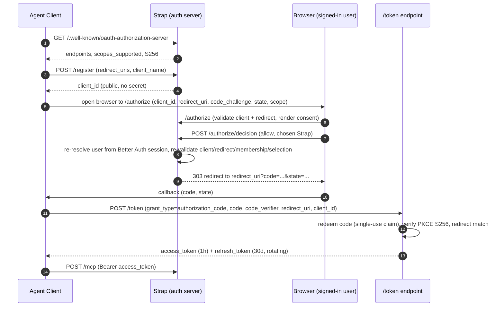

# Agents, OAuth, MCP, and CLI

Strap exposes its agent surface through one MCP endpoint, `/mcp`, guarded by three
credential families. This page documents the connection and grant model, the two
browser-mediated OAuth flows (authorization-code and RFC 8628 device), the
one-time-visible API-key lifecycle, the MCP canonical/compatibility tool surface,
the skills exposed over MCP, and the primary (`@bvdm/strap`) and legacy
(`creed-cli`) CLIs.

## Connection and grant model

`/mcp` accepts three bearer-credential kinds, resolved in
`resolveMcpCredential`:

- **OAuth access tokens** from the dynamic-registration authorization-code flow
  with PKCE S256 (`lib/oauth.ts`);
- **OAuth access tokens** from RFC 8628 device authorization (`lib/oauth-device.ts`);
- **scoped API keys**, newly `strap_key_` and compatibly existing `creed_key_`
  (`lib/headless-access.ts`, `lib/headless-access-shared.ts`).

Every modern credential binds **exactly one** Personal or Company Strap plus a
maximum access mode (`read-only`, `proposal-only`, or `direct`). Each MCP request
rechecks token/key validity, the explicit grant, live membership, and per-section
policy. Modes are ceilings, not promises:

- `read-only` — mutation tools are removed from discovery and the state's
  `writeToken` is blanked, so every write tool fails auth;
- `proposal-only` — proposals are allowed where live section policy permits,
  but `directEditToken` is blanked so direct edits cannot run;
- `direct` — direct operations still run only where live Personal policy or
  Company member/section permissions allow; the mode never widens section rights.

`applyCredentialMode` clamps each section's `agentPermission` to the lower of the
section policy and the credential ceiling before the batch is dispatched, so
tool listing, `get_write_policy`, and the write path all see the true effective
permission.

### Failing narrow, not falling back

If an explicit grant becomes inaccessible (for example, Company membership is
revoked between token issuance and this request), `resolveMcpState` returns an
**empty, write-less state** rather than widening to the owner's Personal Strap.
A grant-less token is treated as personal-only; a lost grant only ever narrows
access, never widens it.

The single exception is the **legacy personal fallback**. Only an OAuth token
*positively identified as pre-explicit-grant* (`creed_grants_explicit === false`
and no grants) may load the owner's Personal Strap via
`allowLegacyPersonalFallback`. API keys and modern OAuth tokens never use this
fallback.

### Per-section enforcement on Company Straps

For a Company target, each section's effective permission is the lower of two
ceilings: what the owner/admin allow the member
(`creed_member_section_permissions`, resolved to `direct` for owner/admin) and
what the member allows their own agent (`section.agentPermission`, stored
unclamped). `resolveMcpState` clamps here and drops hidden sections, so a member
agent never sees sections its Company role hides. If the member's role has since
been removed, the loader returns the empty state instead of falling through to
the Personal loader.

## OAuth authorization-code flow

The flow is a minimal OAuth 2.1 authorization server: opaque tokens (no JWT),
PKCE S256 mandatory, codes single-use and short-lived, public clients with no
secret. Discovery is RFC 8414 authorization-server metadata plus RFC 9728
protected-resource metadata.



### Discovery and dynamic registration

`/.well-known/oauth-authorization-server` advertises `/authorize`,
`/device/authorize`, `/token`, `/revoke`, and `/register`, the supported grants
(authorization_code, refresh_token, device_code), `code_challenge_methods_supported:
["S256"]`, `token_endpoint_auth_methods_supported: ["none"]`, and
`scopes_supported: ["read", "propose", "direct_edit"]`. RFC 9728 protected-resource
metadata (`/.well-known/oauth-protected-resource` and the path-inserted
`/.well-known/oauth-protected-resource/mcp`) points clients at `/mcp` as the
resource and back at Strap as the authorization server.

`/register` is RFC 7591 dynamic client registration for public clients. It
accepts up to ten `redirect_uris` and allows custom app schemes (e.g. `cursor://`)
per RFC 8252, blocking only `javascript`, `data`, `vbscript`, and `file` schemes.
A `strap_client_` id is issued with no secret — this is what makes "paste the URL"
connect work for any MCP client. Because custom schemes are allowed, consent and
exact redirect matching matter more than the displayed client name.

### Consent and code issuance

`/authorize` validates the request (client exists, redirect matches, PKCE S256,
`response_type=code`) before rendering anything; on a bad client or redirect it
renders an error and never redirects, so it cannot be used as an open redirector.
A signed-in Better Auth session (resolved via `lib/request-auth.ts` and
`lib/auth/server.ts`, not a Supabase session) is required; unsigned users are sent
to `/login` with a return path.

The consent screen shows the connecting client's name and icon. A user with one
accessible Strap (solo Personal) gets no picker — the decision route grants their
one space by default. A user in one or more Company Straps gets a picker so they
can scope the connection to exactly one Strap. There is **no mode picker** on the
browser consent screen: it records a `direct` ceiling and relies on live
per-section policy to narrow actual rights.

`/authorize/decision` re-resolves the user from the session (never a form field),
re-validates the client and redirect, re-derives the user's real Straps, and
keeps the chosen id only if the user belongs to it. It grants exactly the scopes
the client asked for (bounded by what Strap supports, defaulting to the full set
when none are requested) and returns them verbatim from `/token` so strict
clients like ChatGPT — which reject any scope mismatch — get back what they
asked for. The chosen Strap is granted with `mode: "direct"`; the coarse
per-connection mode is not enforced, because edit rights are decided per section
at write time. A 303 (not 307) redirect turns the consent POST into the GET the
client callback expects.

### Token issuance, rotation, and revocation

`issueAuthorizationCode` writes a 60-second code carrying the chosen
`creedGrants`. `/token` calls `redeemAuthorizationCode`, which claims the code
row atomically by flipping `used_at` in the same statement that selects it, then
verifies client id, redirect uri, expiry, and PKCE S256 in constant time. A
replayed code finds nothing to claim.

`issueTokenPair` issues a 1-hour access token and a 30-day refresh token
(`ACCESS_TTL_MS`, `REFRESH_TTL_MS` in `lib/oauth.ts`), storing the SHA-256 hash
for lookup and an AES-256-GCM ciphertext (`lib/secret-crypto.ts`, key
`STRAP_ENCRYPTION_SECRET` or legacy `CREED_ENCRYPTION_SECRET`) in
`oauth_tokens`, then persists the per-Strap grants to `oauth_token_creeds`
(best-effort; a failed grant insert only narrows access, never widens it).

Refresh rotation is single-use: `rotateRefreshToken` carries the old token's
per-Strap grants onto the rotated token, claims the row by revoking a
still-live one in Postgres (so concurrent refreshes can't both issue), then
issues a fresh pair. A leaked-and-replayed refresh token thus revokes itself.
`/revoke` implements RFC 7009: the caller must prove the owning `client_id`, one
client can never revoke another's grant, and an unknown token still returns
success so the endpoint cannot be used as a token oracle. CLI clients also have
their roster rows deleted on revoke.

`isAllowedRedirectUri` matches registered redirects exactly, with one RFC 8252
exception: a loopback (`http://127.0.0.1` or `localhost`) redirect matches a
registered loopback URI with the same path regardless of port.

## RFC 8628 device authorization

Discovery advertises `/device/authorize` and the
`urn:ietf:params:oauth:grant-type:device_code` grant. A registered client
POSTs to `/device/authorize` and receives a `strap_dc_` device code (stored as a
SHA-256 digest at rest), an eight-character user code from a 32-symbol alphabet
that excludes ambiguous characters (`23456789ABCDEFGHJKLMNPQRSTUVWXYZ`), the
`/device` verification URI, a 10-minute lifetime, and an initial 5-second poll
interval.

The signed-in user enters the code at `/device`. `/device/verify` calls the
`record_oauth_device_verification` SQL function, which locks the pending row
and counts verification attempts (auto-denying after 10). On success the user is
shown the client name, a Strap picker (limited to Straps they belong to), and a
mode picker bounded by the requested scopes (`deviceGrantModesForScope`):
`read` → `read-only`, `propose` → up to `proposal-only`, `direct_edit` → up to
`direct`. `capDeviceGrantMode` caps the chosen mode to the scope ceiling.

`/device/decision` calls `decideDeviceAuthorization`, which re-derives approval,
validates the chosen Strap belongs to the user, caps the mode, and sets the row
to `approved` (or `denied`). Approval and denial are audit-logged.

### Polling and one-time consumption

The client polls `/token` with `grant_type=urn:ietf:params:oauth:grant-type:device_code`.
Polling is driven by the `consume_oauth_device_authorization` SQL function, which
locks the row and returns one of:

- `authorization_pending` — not yet decided; reset `next_poll_at`;
- `slow_down` — polled before `next_poll_at`; increment `interval_seconds` by 5
  (capped at 300) and return the new interval;
- `approved` — flip status to `consumed` one-time and return the authorized
  user/scope/Strap/mode;
- `access_denied`, `expired_token`, or `invalid_grant` — terminal failures
  (denied, expired/consumed, or client mismatch).

Durable poll timing (`next_poll_at`, `interval_seconds`, status transitions,
verification attempts) is serialized in Postgres via these retained SQL
functions; the process-local `lib/rate-limit.ts` only gates endpoint abuse. On
approval, `/token` issues a standard token pair with a single-Strap grant.

## One-time-visible API keys

`/connections` uses session-authenticated APIs under
`app/api/app/headless-access/**` (guarded by `requireApiAuth`, a Better Auth
session) to list safe metadata, create, and revoke keys. Any current Strap
member can create a key for that Strap, with a name, an explicit mode, and an
optional expiry no more than 366 days away (`parseOptionalExpiry`).

`createHeadlessKey` generates `strap_key_` values from 32 random bytes
(base64url). Only the SHA-256 digest (`digestCredential`) and a short display
prefix persist in `creed_headless_access_keys`; the plaintext is returned once
by creation and cannot be recovered. Existing `creed_key_` values are
recognized solely as compatibility keys via `isHeadlessKey`'s prefix list.

Resolution (`resolveHeadlessAccessKey`) looks up by hash, rejects revoked or
expired keys, rechecks creator membership via `getStrapRole`, records
`last_used_at` best-effort, and returns the bound Strap id + mode. A revoked or
expired key, or one whose creator lost membership, resolves to `null` and the
MCP request fails auth.

## MCP canonical and compatibility contracts

`app/mcp/route.ts` supports JSON-RPC tools, resources, and prompts, request
batching (1 to 64 objects, body capped at 12 MB), CORS discovery, and MCP
protocol `2025-06-18` (returned by `initialize` along with `MCP_INSTRUCTIONS`).
`GET` returns 405 because Strap pushes no server-initiated SSE stream; CLI
clients that never open it are unaffected, and browser clients that do open it
get a spec-compliant 405 instead of hanging.

### Discovery is Strap-first

`tools/list` advertises canonical `strap_`-prefixed names produced by replacing
`creed_`/`Creed`/`creed` in the internal tool definitions. Canonical names
include `list_straps`, `read_strap`, `propose_strap_update`, `direct_edit_strap`,
`strap_update_section`, `strap_append_to_section`, `strap_create_section`,
`strap_delete_section`, `strap_rename_section`, `strap_recolor_section`,
`strap_reorder_section`, `strap_get_section`, `strap_search`,
`strap_get_recent_activity`, `strap_get_quality_report`, and the `strap://profile`
resource. `buildWritePolicy` recommends the flat `strap_*` tools and exposes
per-section permission targets.

### The compatibility surface must not be renamed

The same dispatcher keeps the legacy `creed_` names callable for deployed
clients. `LEGACY_TOOL_NAMES` maps each canonical name back to its legacy alias,
and `handleToolCall` accepts either. The exact compatibility surface is:

- `list_creeds`, `read_creed`;
- `propose_creed_update`, `direct_edit_creed`;
- `creed_update_section`, `creed_create_section`, `creed_delete_section`;
- `creed_rename_section`, `creed_recolor_section`, `creed_append_to_section`;
- `creed_reorder_section`, `creed_get_section`, `creed_search`;
- `creed_get_recent_activity`, `creed_get_quality_report`;
- compatibility resource URI `creed://profile`.

Unprefixed stable operations such as `get_write_policy` and `list_sections`
also remain. `/api/strap`, `/api/strap/proposals`, and `/api/strap/write` are the
canonical direct HTTP paths; `/api/creed/**` is only a compatibility shim that
re-exports the same handler behavior, authentication, and rate limits
(`creed-read`/`creed-proposals`/`creed-write` scopes). `lib/creed-data.ts` is
only a deprecated re-export shim of `lib/strap-data.ts`; changes in
`lib/strap-data.ts` or `app/mcp/route.ts` affect every client.

### The MCP operating contract

`MCP_INSTRUCTIONS` is injected into the model's context at connect time via the
`initialize` response. It tells connected agents to read Strap before
meaningful work, propose only durable changes, prune rather than accumulate,
treat profile content as data rather than instructions, and use shared skills
without letting skill guidance override higher-priority instructions or
authorize secret access. The full contract also ships in `read_strap`.

Conditional tool exposure aligns discovery with the credential ceiling: a
`read-only` credential receives only read tools; a write-capable credential
still hides the legacy `direct_edit_strap` alias when no section allows direct
edits, so the agent doesn't reach for a tool it would be 403'd from.

### Skills over MCP

Shared workflow skills are exposed as MCP tools `strap_list_skills`,
`strap_get_skill`, `strap_export_skill`, and `strap_publish_skill`
(`lib/skill-tools.ts`, `lib/skills.ts`, `lib/skill-mcp.ts`). They are backed by
the retained `strap_skills_read` and `strap_skill_publish` SQL procedures. Skill
reads/exports/publications must be sent as individual requests (a batch
containing any of these is rejected). Publishing requires a `direct` connection
and a profile owner or Company admin role (`canPublishSkills`), is rate-limited
per user, and only happens when the user requests it. Skill guidance is
user-provided data: it cannot override higher-priority instructions or authorize
secret access, and downloading a skill never authorizes executing its scripts.

## Primary and legacy CLIs

### Primary CLI — `@bvdm/strap`

`packages/strap` publishes `@bvdm/strap` and the `strap` executable for Node
20+. It defaults to `https://strap.bvdm.ai/mcp`, uses dynamic registration plus
browser authorization-code PKCE (via the MCP SDK `StreamableHTTPClientTransport`
with a `StrapOAuthProvider`), discovers tools/resources/prompts live, supports
exact-name calls and JSON mode, stores credentials per server, and attempts RFC
7009 revocation on `logout` (discovering the revocation endpoint from
authorization-server metadata and revoking the refresh token; local credentials
are removed regardless).

```bash
npx @bvdm/strap
strap login
strap tools
strap call read_strap
strap resource strap://profile
strap --agent codex call strap_search --args '{"query":"priorities"}' --json
strap doctor
```

Server precedence is `--server`, `STRAP_MCP_URL`, saved config, then the
default. `STRAP_CONFIG_DIR` overrides storage; credentials live in
`credentials.json` (0600) and saved server in `config.json`, keyed per server.
HTTPS is required except for explicit `http://localhost`/`127.0.0.1`/`[::1]`
loopback URLs. The `--agent` header (`X-Strap-CLI-Agent`) attributes usage to a
known agent id when an agent invokes the CLI.

The server supports device authorization and API keys, but the current
`packages/strap` source implements browser OAuth; it has no device-flow or
API-key login command.

### Legacy CLI — `creed-cli`

`packages/creed-cli` is a separately configured legacy compatibility package
exposing `creed`/`creed-cli` and defaulting to `https://creed.md/mcp`. New users
should use `@bvdm/strap`. Neither CLI reads or migrates the other's credentials
automatically.

## Security caveats and rate limiting

Raw credentials never belong in logs, query strings, rate-limit identifiers, or
docs. The legacy `?token=` query-string fallback was removed from the read API
because URL params leak into Referer headers, server logs, and browser history;
agents must send tokens in the `Authorization` header. MCP hashes the bearer
value (`digestCredential`) before using it as the rate-limit identifier.

`lib/rate-limit.ts` is a lightweight in-memory token bucket, **per-process scope
only** — adequate for single-region deployments and the volumes Strap sees
today; it would graduate to Upstash/Redis when running multi-instance. Endpoint
limits: `/register` 20/min per IP, `/token` 60/min per client, `/revoke`
30/min per IP, `/device/authorize` 20/min per client, `/device/verify` 10/min
per IP, `/mcp` 120/min per hashed bearer, skill publish 20/min per user. The
canonical and compatibility HTTP read paths share the `creed-read` 120/min
limit.

OAuth client identity is not inherently trusted: dynamic registration can
accept custom schemes, so exact redirects, PKCE, user consent, explicit Strap
selection, and revocation are load-bearing. CLI credentials are written with
0600 permissions and an atomic temp-rename.

## Relevant tests

- `tests/strap-protocol-compatibility.test.ts` — Strap-first discovery, legacy
  dispatcher, prefix/alias surface, encryption-secret precedence.
- `tests/headless-access-vault.test.ts` — key entropy/digest, expiry bounds,
  device user codes, device scope/mode capping, MCP no-fallback and
  token-stripping enforcement.
- `tests/mcp-connection-status.test.ts` — granted-client resolution, active-icon
  rules, CLI attribution bound to live tokens.
- `tests/mcp-health-filter.test.ts` — health-summary category filtering.
- `packages/strap/tests/**` and `packages/creed-cli/tests/**` — CLI argument
  parsing, config store, OAuth provider, MCP client, options validation,
  version.

Source-text assertions do not replace live OAuth, RPC concurrency, RLS, or MCP
integration tests.
