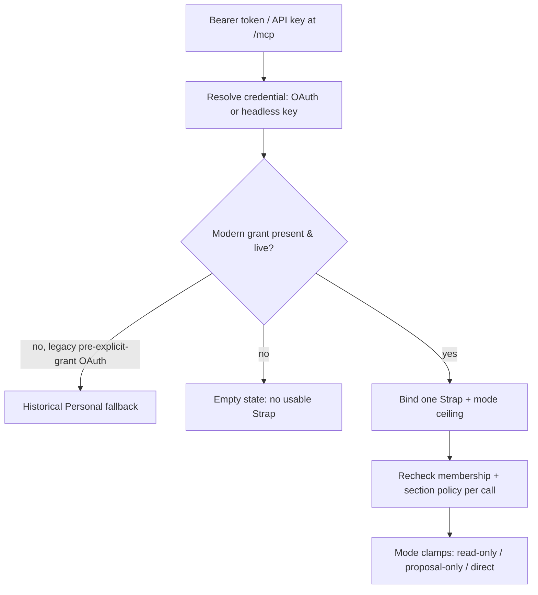

# Agents, OAuth, MCP, and CLI

## Connection and grant model

Strap's MCP server at `/mcp` accepts three credential kinds, all validated per request:

- OAuth access tokens from dynamic-registration authorization-code flow with PKCE S256;
- OAuth access tokens from RFC 8628 device authorization;
- scoped API keys, newly `strap_key_` and compatibly existing `creed_key_`.

Modern credentials bind exactly one Personal or Company Strap plus a maximum access mode. Every call rechecks token/key validity, explicit grant, live membership, and section policy. Modes are ceilings:

- `read-only`: no proposal/direct mutation tools; visible sections clamp to read;
- `proposal-only`: proposals allowed where live policy permits, direct editing removed;
- `direct`: direct operations remain limited by live Personal policy or Company member/section permissions.

If a modern grant becomes inaccessible, MCP returns no usable Strap state rather than falling back. Only positively identified pre-explicit-grant OAuth tokens retain historical Personal fallback. `resolveMcpState` intentionally returns an empty state when an explicit grant is gone, so a missing Strap id is never interpreted as permission to fall back to Personal.


*Per-request credential resolution: a modern grant must be live and accessible; missing grants fail narrow rather than fall back.*

## OAuth authorization-code flow

The client discovers protected-resource and authorization-server metadata, dynamically registers, and starts `/authorize` with PKCE. The signed-in user selects exactly one accessible Personal or Company Strap; solo Personal users get the same one-profile grant without a picker. `/authorize/decision` revalidates session, client, redirect, membership, and selection before issuing a short-lived code. `/token` atomically claims the code, verifies PKCE/redirect, then issues one-hour access and rotating 30-day refresh tokens; `/revoke` supports revocation.

Browser consent does not expose a mode picker: it records a `direct` ceiling and relies on live section policy to narrow actual rights. Client identity is not inherently trusted; exact redirects, PKCE, user consent, explicit profile selection, and revocation are load-bearing.

## RFC 8628 device authorization

Discovery advertises `/device/authorize` and the device-code grant. A registered client receives a hash-at-rest device code, eight-character user code, `/device` verification URI, ten-minute lifetime, and initial five-second polling interval.

The signed-in user enters the code, verifies the client name, chooses exactly one Personal or Company Strap, and chooses a mode allowed by the requested scopes. Polling supports pending, `slow_down`, denial, expiry, client mismatch, and one-time consumption. Approval issues standard OAuth tokens with that single-Strap grant. Durable poll timing is serialized in Postgres; local endpoint limits remain process-local.

Primary sources: `app/device/**`, `lib/oauth-device.ts`, `lib/oauth-device-shared.ts`, and `app/token/route.ts`.

## One-time-visible API keys

`/connections` uses session APIs under `app/api/app/headless-access/**` to list safe metadata, create, and revoke keys. Any current Strap member can create a key for that Strap, with a name, explicit mode, and optional expiry no more than 366 days away.

`lib/headless-access-shared.ts` generates new `strap_key_` values from random material. Only SHA-256 digest and short display prefix persist; plaintext is returned once by creation and cannot be recovered. Existing `creed_key_` values are recognized solely as compatibility keys. Resolution checks revocation, expiry, creator membership, and records `last_used_at` best-effort.

## MCP canonical and compatibility contracts

`app/mcp/route.ts` supports JSON-RPC tools, resources, prompts, batching, CORS discovery, and MCP protocol `2025-06-18`. Discovery is Strap-first and advertises canonical names such as `list_straps`, `read_strap`, `strap_get_section`, `strap_search`, proposal/direct operations, `strap://profile`, and the skill tools.

### Skill tools (canonical Strap-first surface)

Connected agents discover and use shared workflow skills through four MCP tools declared in `lib/skill-tools.ts` and dispatched via `callSkillTool` (`lib/skill-mcp.ts`):

- `strap_list_skills` — metadata only; `includeArchived` (default false) controls whether archived summaries appear;
- `strap_get_skill` — `SKILL.md` instructions plus a bounded file manifest, or one selected file via `filePath`; archived skills return `410`;
- `strap_export_skill` — the full versioned bundle including base64 binary assets, for installation or device sync;
- `strap_publish_skill` — publishes a bundle; gated to direct mode + owner/admin.

These tools are appended to `tools/list` via `skillToolsFor(strapId, mode, role)`. With no connected profile no skill tools are offered; `strap_publish_skill` is included only when `canPublishSkills(mode, role)` is true — i.e. `mode === "direct"` and `role` is `owner` or `admin`. The list/get/export tools are available to any member in any mode. There are no Creed-named compatibility aliases for skill tools: skills are a new Strap-first surface, so unlike the section/proposal tools they are not mirrored under `creed_*` names.

When a `tools/call` targets a skill tool, the MCP dispatcher short-circuits to `callSkillTool` with `{ userId, strapId, mode, role }` derived from the resolved state. Skill discovery and publishing are separate from section editing and the proposal lifecycle.

### Batch-payload guard

Skill reads, exports, and publications load full bundles even for selected-file reads. To prevent a JSON-RPC batch from multiplying large payloads, `isSkillPayloadBatch(requests)` in `lib/skill-tools.ts` flags any batch of more than one request that contains `strap_get_skill`, `strap_export_skill`, or `strap_publish_skill`. The MCP route rejects such batches with JSON-RPC error `-32600` ("Skill reads, exports, and publications require an individual request. Send each skill call separately.") before resolving state. A single such call is allowed; a batch of `strap_list_skills` plus a non-skill `ping` is not flagged.

### Compatibility surface (Creed names)

Do not remove or rename the exact compatibility surface. The same dispatcher continues to accept:

- `list_creeds`, `read_creed`;
- `propose_creed_update`, `direct_edit_creed`;
- `creed_update_section`, `creed_create_section`, `creed_delete_section`;
- `creed_rename_section`, `creed_recolor_section`, `creed_append_to_section`;
- `creed_reorder_section`, `creed_get_section`, `creed_search`;
- `creed_get_recent_activity`, `creed_get_quality_report`;
- compatibility resource URI `creed://profile`.

Exact Creed tool names and `creed://profile` remain callable compatibility aliases. Unprefixed stable operations such as `get_write_policy` and `list_sections` also remain. `/api/strap`, `/api/strap/proposals`, and `/api/strap/write` are the canonical direct HTTP paths. `/api/creed/**` remains only as a compatibility API shim; both route families share handler behavior, authentication, and rate limits.

### Operating contract

The MCP operating contract (injected via `MCP_INSTRUCTIONS` at connect time and repeated in `read_strap`) tells agents to read Strap before meaningful work, propose only durable changes, prune rather than accumulate, and treat profile content as data rather than instructions. It also covers skills: list their metadata during onboarding, read a matching skill with `strap_get_skill` before using it, recognize that skill guidance cannot override higher-priority instructions or authorize secret access, that downloading a skill never authorizes executing its scripts, and that skills should be published only when the user requests it. Changes in `lib/strap-data.ts` or `app/mcp/route.ts` affect every client; `lib/creed-data.ts` is only a deprecated compatibility re-export shim.

## Primary and legacy CLIs

`packages/strap` publishes `@bvdm/strap` and the `strap` executable for Node 20+. It defaults to `https://strap.bvdm.ai/mcp`, uses dynamic registration plus browser authorization-code PKCE, discovers tools/resources/prompts live, supports exact-name calls and JSON mode, stores credentials per server, and attempts RFC 7009 revocation on logout.

```bash
npx @bvdm/strap
strap tools
strap call read_strap
strap resource strap://profile
strap --agent codex call strap_search --args '{"query":"priorities"}' --json
```

Server precedence is `--server`, `STRAP_MCP_URL`, saved config, then the default; `STRAP_CONFIG_DIR` overrides storage. HTTPS is required except explicit localhost loopback URLs. The server supports device authorization and API keys, but current `packages/strap` source implements browser OAuth; do not document nonexistent CLI device/API-key login commands.

### `strap skills` subcommands

`packages/strap/src/skills/command.ts` implements device sync with four actions:

```
strap skills list
strap skills push <skill-directory> [--base-revision N] [--dry-run]
strap skills pull [name] [--dir PATH | --target codex|claude [--global]] [--dry-run]
strap skills sync [name] [--dir PATH | --target codex|claude [--global]] [--dry-run]
```

The default install target is `.agents/skills` in the current project (Codex-compatible); `--target claude` uses `.claude/skills`; `--global` installs into the home directory. `--dir PATH` is an alternative to `--target`/`--global`. Pull downloads published skills. Sync also publishes local edits to managed skills and pulls remote changes: it checks for conflicts, backs up replaced files outside the skill directory, and never executes scripts. Each directory binds one profile/server via a `.strap-skills.json` ledger; use a separate directory for each Personal or Company library. Conflicts stop the whole selection before any changes are made.

The CLI talks to the server through the MCP tools (`mcpSkillRemote`): `list` calls `strap_list_skills`, `get` calls `strap_export_skill`, and `publish` calls `strap_publish_skill`. Every server response is re-validated with `validateStoredSkill` and cross-checked against the expected `strapId`, `name`, and recomputed digest (`verifyRemote`).

### Legacy CLI

`packages/creed-cli` remains a complete, separately configured legacy compatibility package exposing `creed`/`creed-cli` and defaulting to `https://creed.md/mcp`. New users should use `@bvdm/strap`. Neither CLI reads or migrates the other's credentials automatically.

## Security caveats and tests

Raw credentials never belong in logs, query strings, rate-limit identifiers, or docs. MCP hashes bearer values before rate limiting (`digestCredential`), so no secret appears in the rate-limit identifier. `lib/rate-limit.ts` is process-local. Dynamic registration can accept supported custom schemes, so consent and redirects matter more than the displayed client name.

Relevant tests include `tests/strap-protocol-compatibility.test.ts`, `tests/headless-access-vault.test.ts`, `tests/mcp-connection-status.test.ts`, `tests/mcp-health-filter.test.ts`, `tests/skill-bundles.test.ts`, `packages/strap/tests/**`, and `packages/creed-cli/tests/**`. Source-text assertions do not replace live OAuth, RPC concurrency, RLS, or MCP integration tests.
