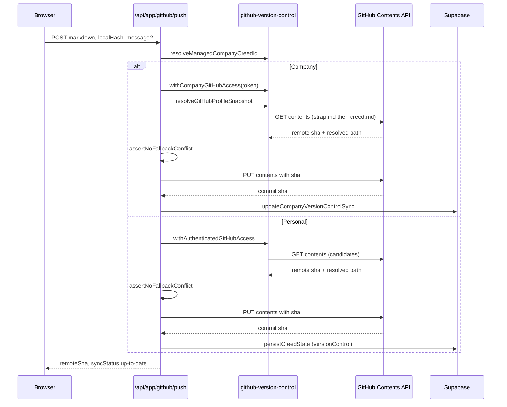

# Platform integrations

## Supabase

Supabase provides authentication, Postgres, RLS, realtime, retention scheduling, and the `supabase_vault` extension used by `/vault`. Session clients operate under RLS. OAuth, Company writes, and secret-bearing integrations often use the admin client, which bypasses RLS and therefore requires explicit application authorization first.

The ordered SQL files in `supabase/migrations/` are canonical, forward-only schema history. Their Creed- and Stripe-named objects are not renamed during the Strap rebrand; the deliberate exception is the new skill library (below).

Shared workflow skills are stored in Supabase as new Strap-named tables — `strap_skills` (current bundles) and `strap_skill_versions` (retained history) — accessed only through service-role RPCs (`strap_skills_read`, `strap_skill_publish`) that revoke execution from `public`, `anon`, and `authenticated` and recheck live `creed_members` membership and role inside the database. No client role receives direct table access. Each profile library is bounded by a 64 MiB storage budget (current bundles plus retained versions) and a 100-skill cap. See [Schema and security](../data/schema-and-security.md) for the RLS, RPC, and storage-boundary detail and [Shared skills system](../domain/skills-system.md) for the publish, versioning, agent, and device-sync flow; this page does not duplicate them.

## OpenRouter: Included AI and BYOK

AI routes under `app/api/app/ai/**` resolve the active Strap and permission, choose a server-controlled model, build bounded context, call `lib/ai/openrouter.ts`, validate the response, and record usage. The model is server-selected per feature and hidden from the user in both credential modes.

Two credential modes exist, resolved by `lib/ai/credits.ts` from the stored `ai_mode`:

- **Included:** uses `OPENROUTER_PLATFORM_KEY`. The historical database value is `ai_mode = 'credits'`, surfaced in the UI as "Included", but no credits are sold or debited. If the deployment has no platform key, `getOpenRouterPlatformKey()` throws and users must configure BYOK.
- **BYOK:** decrypts a valid Personal (`creed_ai_settings`) or Company (`creed_company_ai_settings`) OpenRouter key. A missing or invalid key rejects the call before it leaves the server.

`lib/ai/credits.ts` retains its historical filename but enforces operational limits rather than billing:

- process-local burst limit: 20 included-AI requests per user per 60 seconds (`checkRateLimit`, scope `included-ai`);
- trailing-24-hour estimated-cost limit: `$0.50` per user by default, summed from `creed_ai_usage` rows where `ai_mode = 'credits'`;
- deployment override: `INCLUDED_AI_DAILY_LIMIT_USD` (a positive finite number wins over the default). BYOK calls do not count toward this limit.

Every successful AI call records a row in `creed_ai_usage` via `recordAiUsage` — feature, model id/quality, input/output tokens, at-cost `estimated_cost_usd`, and the actually-charged `charged_micro_usd` (marked-up in Included mode, at-cost in BYOK). Company usage is stamped with the Company `creed_id` so the company spend chart can attribute it. There is no debit RPC, prepaid balance, checkout, or runtime payment flow.

`lib/ai/openrouter.ts` posts to `https://openrouter.ai/api/v1/chat/completions` with `HTTP-Referer` set to the site URL and `X-Title: Strap`, requests `usage: { include: true }`, and prefers OpenRouter's authoritative `usage.cost` for the recorded cost, falling back to `estimateAiCostUsd`. The streaming sibling (`streamOpenRouter`) drives the in-app agent route. Profile content sent to OpenRouter crosses an external privacy boundary; outputs are untrusted until parsed and validated. BYOK values are exposed client-side only as safe status/last-four metadata (`api_key_last_four`, `key_status`), never the key itself.

## GitHub version control

New Personal and Company configurations default to visible `strap.md`; migration `20260724120000_strap_profile_defaults.sql` updates database defaults. `lib/profile-file.ts` controls compatibility:

- blank or configured `strap.md` resolves candidates in order: `strap.md`, then legacy `creed.md`;
- any other stored path is read exactly, without fallback;
- push refuses to create a competing `strap.md` when a read resolved legacy `creed.md` (`hasProfilePathConflict`), so migration to `strap.md` must be explicit.

*Personal and Company push both fetch the remote SHA for optimistic concurrency, reject a fallback-path conflict, then PUT through the GitHub Contents API and persist sync state.*

### Authorization and storage

`/api/app/github/authorize` mints an anti-CSRF nonce, stashes it with mode (`personal`/`company`) and optional `creedId` in the short-lived `github_oauth_state` httpOnly cookie, and redirects to GitHub's `login/oauth/authorize` with scope `repo read:user` and `prompt=consent`. Company mode requires the caller's role to be `owner` or `admin` before the redirect. The shared callback `/auth/github/callback` verifies cookie/session and nonce, exchanges the code via `exchangeGitHubOAuthCode`, fetches the GitHub viewer, and stores an encrypted token — personal into `creed_integrations` (per user), company into `creed_company_github_integration` (per creed, manager-only). A single shared "Creed" OAuth App backs both flows. The `repo read:user` scope is broad; the access token is AES-256-GCM encrypted at rest through `lib/secret-crypto.ts`.

Token refresh is handled by `withAuthenticatedGitHubAccess`: it proactively refreshes when the token expires within two minutes, and retries once on a `bad credentials`/expired error before giving up. Refresh requires `GITHUB_OAUTH_CLIENT_ID`/`SECRET` to be configured.

### Push/pull

Push fetches the remote SHA via `resolveGitHubProfileSnapshot` and uses GitHub Contents optimistic concurrency (PUT with the current `sha`, or without one to create). The default commit message is `Update Strap`. Company managers push to the company repo on the team's GitHub connection (never a personal token); personal Straps push on the user's own connection.

Personal pull has two phases. `/api/app/github/pull/preview` fetches and parses the remote file, resolves sync status, and returns sections without writing. `/api/app/github/pull/apply` is authoritative: it replaces active sections with the imported ones, forces every imported section to `agentWritable: true` with `agentPermission: "propose"` so connected agents can edit post-pull, clears proposals, and retains archived sections the import did not reintroduce (they stay restorable from Settings). Company pull is not implemented — company managers can only push out.

Preview/apply is not bound to a freshly fetched remote SHA, so stale preview data can be applied. Maintain `tests/github-roundtrip.test.ts` and the profile-path tests when changing the flow.

### Format

`lib/strap-markdown.ts` and `lib/rich-text.ts` preserve supported formatting, adjust headings, and retain the compatibility comment `<!-- creed:accent=... -->` so a section's accent color survives a push/pull round trip. `lib/creed-markdown.ts` is only a deprecated compatibility re-export shim; format identifiers stay unchanged even though customer-facing defaults are Strap.

## Pricing and removed Stripe runtime

`lib/marketing/pricing.ts` is the single public pricing source, shared by the pricing cards, the crawlable pricing reference, the `SoftwareApplication` Offer schema, and `/llms.txt`. All three plans are `$0 forever`:

- **Open:** `$0 forever`, self-host the open source build, BYOK;
- **Personal:** `$0 forever`, hosted, included AI or BYOK;
- **Company:** `$0 forever`, hosted, included AI or Company BYOK, invite as many members as needed.

Stripe has been removed from active dependencies (`package.json` has no Stripe dependency) and from runtime routes. There is no checkout, webhook, paid-plan gate, or paid Company-seat flow. Company creation is direct and idempotent through `POST /api/app/company` (`provisionCompany`, one owned company per owner); invites are not purchased seats.

The only remaining Stripe touchpoint is legacy offboarding: `/api/app/legacy-subscriptions` reads historical `creed_entitlements` / `creed_company_billing` rows and, if `STRIPE_SECRET_KEY` is still configured, lets a user with a pre-existing subscription confirm and self-cancel it directly with Stripe. `.env.example` retains `STRIPE_SECRET_KEY` under a "Legacy Stripe offboarding only" heading to be removed once every legacy subscription is canceled.

Historical migrations and rows such as `creed_entitlements`, `creed_company_billing`, Stripe columns, and seat-purchase records remain for forward-only history and limited compatibility state. They do not describe current paid plans. `lib/welcome.ts` still uses `creed_entitlements` / `creed_company_billing` for one-time welcome dismissal, not billing — every helper is fault-tolerant and resolves to "don't show" on any error.

## Configuration and deployment

Use `.env.example` only as a placeholder inventory; never read or expose `.env.local`. New deployments should use `STRAP_ENCRYPTION_SECRET` for token and payload encryption and `STRAP_AGENT_MODEL` to override the Included AI agent model. Runtime checks the corresponding `CREED_ENCRYPTION_SECRET` and `CREED_AGENT_MODEL` names only as lower-priority compatibility fallbacks; when both forms are set, the Strap value wins (`process.env.STRAP_* || process.env.CREED_*`). Other configuration covers site/Supabase values, `OPENROUTER_PLATFORM_KEY` and `INCLUDED_AI_DAILY_LIMIT_USD`, optional `GITHUB_OAUTH_CLIENT_ID`/`SECRET`, Resend email, and branding values. CSP enforcement flips from Report-Only to enforcing when `STRAP_CSP_ENFORCE=1` (falling back to `CREED_CSP_ENFORCE=1`); run unset for at least one deploy cycle to watch for violations first.

`next.config.ts` constrains known network origins in `connect-src` (Supabase, OpenRouter, GitHub API), blocks framing (`frame-ancestors 'self'`), and pins user-specific HTML paths to `private, no-store` so a shared device can never serve one user's rendered page to another. Static `/assets/*` are versioned by filename and cached hard (`max-age=31536000, immutable`). Root `tsconfig.json` excludes both independent CLI packages (`packages/strap` and `packages/creed-cli`); verify the primary `@bvdm/strap` CLI with its own `typecheck` and `test` scripts.

The Git remote and current repository/package metadata use [MajesteitBart/Strap](https://github.com/MajesteitBart/Strap). Retain `MajesteitBart/Creed` only when documenting explicit historical evidence.
